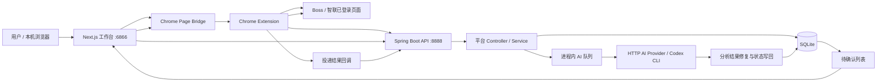
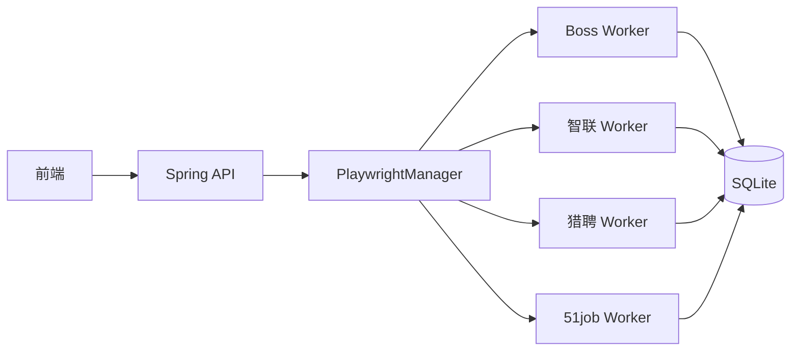
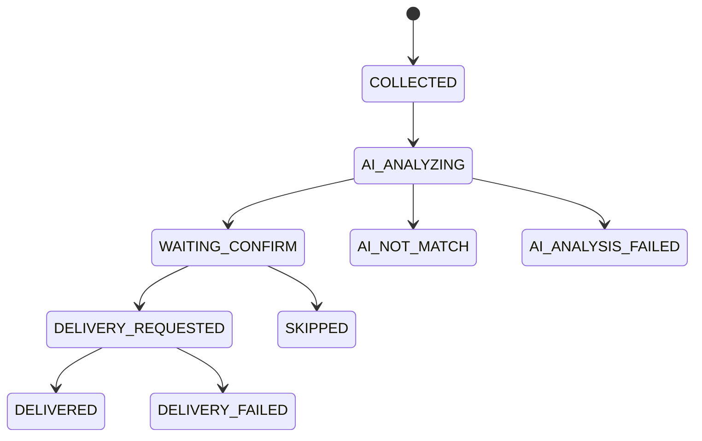
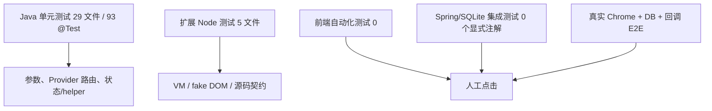
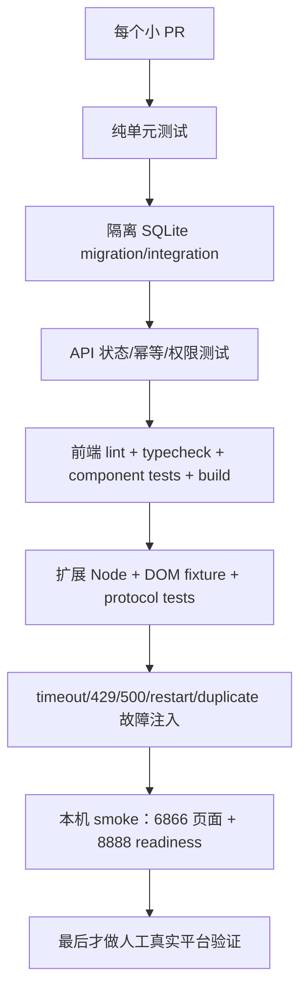

# PROJECT AUDIT — 投递牛马 AI-JobPilot V1

> 审计日期：2026-08-24
> 审计方式：Codemap 全量模块地图 + Code Overhaul 全量工程审计 + 本地 SonarQube Community Build 静态扫描
> 审计原则：只审计，不修改生产业务代码；不访问真实招聘网站、不调用真实 AI Provider、不发送真实投递、不修改现有业务数据。

## 0. 结论先行

### 当前等级

**可用 V1（仅限本机、单用户、人工在环）**。

它高于 Demo：核心链路已经真实接通，能够配置档案、从招聘平台采集岗位、持久化数据、调用 AI 分析、人工确认并驱动投递；已有 Java 单元测试、扩展纯函数测试、前端构建和 Windows/Docker 启动脚本。

它还不是“稳定 V1”：进程重启、第三方超时、重复回调、半成功、并发扫描、旧数据库迁移、跨档案数据隔离和敏感接口暴露时，系统不一定进入明确且可恢复的状态。当前稳定性在很大程度上依赖以下前提：

1. 只有一个可信用户在本机使用；
2. 招聘网站 DOM、登录态和扩展协议没有突然变化；
3. AI Provider 能在合理时间返回格式近似正确的内容；
4. 程序不在 AI 队列或投递回调中途重启；
5. 当前 SQLite Schema 恰好兼容运行时补丁；
6. 用户能够通过页面、日志和人工观察发现隐式失败。

### 总健康度

**50 / 100**

这是“功能已经成形，但工程保护不足”的分数。Codemap 对 15 个功能模块的独立评分平均为 **52.5 / 100**：13 个 D、2 个 C，没有 A/B 模块；最弱区域是猎聘/51job 后端（42）、共享 API 契约（43）、旧 Playwright Worker（43）和数据基础（45）。

### 最重要的判断

- **为什么现在能跑：** Chrome 扩展利用已登录页面执行 Boss/智联主流程；SQLite 降低部署复杂度；多级 DOM/API fallback、旧 Playwright 路径和运行时 DDL 吸收了历史差异；本机单用户降低了并发和安全压力。
- **哪些相对可靠：** Chrome page bridge 已限制消息来源与类型；Codex CLI 采用 read-only sandbox、并发槽位、超时和临时目录清理；AI 队列有容量上限与进程内去重；Docker 对外端口默认绑定 loopback；Java/前端已有基础 CI。
- **哪些只是侥幸：** 投递“点击过”常被当作“真实发送成功”；任务状态没有持久化恢复；多处异常被转换为 `0`、`SKIP`、空结果或 `success=true`；Schema 有 Flyway 与运行时 DDL 多套真相；敏感 API 的安全性依赖用户没有把服务暴露出去。
- **第一原则：** 先保护数据、安全边界和状态真实性，再补失败恢复与测试；最后才拆大组件、清理旧代码。不要先做全面重构。

---

## 1. 审计范围、证据与限制

### 1.1 已覆盖范围

- Java/Spring Boot API、Service、MyBatis/SQLite、Flyway、Playwright Worker；
- Next.js/React 前端页面、配置、分析与确认投递界面；
- Chrome Extension 的 background、page bridge、Boss/智联 content scripts；
- AI Provider、Codex CLI、Prompt/JSON 修复、队列与状态写回；
- Gradle、pnpm、Docker、Windows 启动脚本、GitHub Actions、文档和 demo；
- 15 个功能模块，52,425 行、233 个文件。

### 1.2 本轮没有做

- 没有真实登录招聘网站或发送简历；
- 没有调用会计费的 AI Provider 或已登录 Codex CLI；
- 没有启动生产数据库迁移、修改 Schema 或清理历史数据；
- 没有验证真实多用户、互联网暴露或 SaaS 部署；
- 没有删除 Dead/Legacy Code；
- 没有为了评分修改生产代码或补“凑百分比”的测试。

### 1.3 证据置信度

| 等级 | 含义 |
|---|---|
| 高 | Codemap、人工 Review、SonarQube/测试中至少两方一致，或代码路径可直接证明 |
| 中 | 人工 Review 与模块审计一致，但需要真实故障注入确认发生频率 |
| 待验证 | 静态代码显示风险，但必须用隔离运行/攻击样例确认，不能直接称为已发生漏洞 |

---

## 2. 项目架构图：整个系统怎么跑

### 2.1 当前主业务链



### 2.2 仍在运行的旧链



当前实际状态不是“一套统一平台架构”，而是：

- Boss、智联：Chrome Bridge 是主链，旧 Playwright 代码仍部分接线；
- 猎聘、51job：仍主要依赖 Playwright；
- 前端、扩展、后端各自保留平台特化状态和兼容格式；
- `application/platform` 有抽象雏形，但尚未成为所有平台的真实执行边界。

这解释了项目为什么能够兼容不同阶段的实现，也解释了为什么一次改动可能同时影响页面、扩展消息、后端状态、数据库和旧 Worker。

### 2.3 核心状态流



上图是应有的逻辑模型；当前代码没有在数据库层统一强制这些合法转换。重复/延迟回调可以直接覆盖终态，旧 Worker 还会在没有真实发送确认时直接写 `DELIVERED`。

### 2.4 Codemap 模块清单

| 模块 | 职责 | 耦合 | LOC | 分数 | 主要 Blast Radius |
|---|---|---:|---:|---:|---|
| 前端壳与配置中心 | 首页、档案、配置、SSE/API helper | 高 | 3,246 | 68 C | 所有页面与敏感配置 |
| 平台扫描控制页 | 四平台登录、扫描、停止、进度 | 高 | 4,179 | 58 D | 平台运行状态与用户操作 |
| 分析与确认投递界面 | 统计、筛选、确认、批量投递 | 核心 | 5,111 | 55 D | 状态判断和真实投递 |
| Chrome Bridge 网关 | 消息、导航、回调、协议 | 核心 | 1,839 | 58 D | 扩展全部采集/投递 |
| Boss 扩展适配器 | API/DOM 多级采集、恢复、投递 | 核心 | 6,012 | 52 D | Boss 全链路 |
| 智联扩展适配器 | DOM 采集、恢复、投递 | 高 | 3,230 | 50 D | 智联全链路 |
| API 运行时与共享契约 | CORS、健康、配置、Cookie、DTO | 核心 | 1,673 | 43 D | 全局安全与运行入口 |
| Boss 后端业务 | 配置、入库、统计、状态 | 核心 | 4,221 | 55 D | Boss 数据与投递 |
| 智联后端业务 | 配置、入库、队列、状态 | 核心 | 2,134 | 50 D | 智联数据与投递 |
| 猎聘与 51job 后端 | 旧平台配置、入库、统计 | 高 | 2,680 | 42 D | 旧平台与多档案数据 |
| AI 分析与 Provider | Prompt、Provider、队列、写回 | 核心 | 3,028 | 52 D | 费用、判断与所有平台状态 |
| 数据与配置基础 | Schema、Profile、Config、Cookie | 核心 | 861 | 45 D | 全库数据一致性 |
| Playwright 运行时 | Browser/Page 生命周期、Cookie、锁 | 核心 | 3,416 | 55 D | 四平台浏览器状态 |
| 旧平台 Playwright Worker | 搜索、分析、投递执行 | 高 | 4,456 | 43 D | 旧平台真实动作与状态 |
| 构建、交付与文档 | Gradle/pnpm/Docker/CI/文档 | 中 | 6,339 | 61 C | 可复现构建与发布判断 |

完整交互地图见 `.codemap/codemap.html`，文本版见 `.codemap/codemap.md`。

---

## 3. 项目健康度

| 维度 | 分数 | 依据 |
|---|---:|---|
| 架构合理性 | 5/10 | 本地单体 + SQLite 符合 V1 规模，没有必要上微服务；但 Chrome/Playwright 双主线、跨层 Controller、God Service 与未落地 Adapter 造成边界不清 |
| 业务逻辑 | 6/10 | 核心用户流程完整且有人工作流；失败/部分成功/重复回调/旧 Worker 假成功没有统一状态机 |
| 代码质量 | 5/10 | TypeScript strict、模块命名基本可读；同时存在多个 1,000–4,700 行文件、平台复制、静默 catch、散落 fallback |
| 数据设计 | 4/10 | SQLite 足够简单，已有 Flyway 和索引；但多套运行时 DDL、缺少 FK/UNIQUE、跨扫描重复、Profile 隔离不完整 |
| 稳定性 | 4/10 | 有容量限制、超时和部分去重；AI 队列不可恢复、Provider 无 request timeout、页面/投递状态常把未知当成功 |
| 测试 | 4/10 | 29 个 Java 测试文件、93 个 `@Test`、5 个扩展测试文件；没有前端测试，也没有 Spring 集成测试注解，核心浏览器/数据库/恢复链仍靠人工 |
| 安全性 | 4/10 | `.env` 已忽略、未发现当前跟踪文件中的常见真实密钥签名、Docker 端口绑定本机；但敏感配置/Cookie API 无认证、原文返回，原生后端未强制 loopback |
| 性能与资源 | 6/10 | V1 数据量下可接受；多个平台列表/统计整表载入内存，Boss/智联分析页和扩展脚本巨大，AI fallback 可能重复计费 |
| 可观测性 | 5/10 | 有日志、SSE 进度、诊断接口；健康接口不检查 DB/队列/AI，多处错误变空结果或 success，无法可靠识别半成功 |
| 文档与可维护性 | 6/10 | README、架构、Windows/Docker 文档和 CI 都已存在；旧文档、多启动入口、多交付路径和实际测试契约存在漂移 |
| **总分** | **50/100** | **可用 V1；尚未稳定** |

---

## 4. SonarQube 客观指标

<!-- SONAR_RESULTS_START -->

### 4.1 扫描指标与人工分诊

扫描环境：本机 SonarQube Community Build **26.8.0.126808**；分析 ID `cdd6d218-2030-45a3-89a9-af3449b5e3b9`。临时分析 Token 已在 `finally` 中撤销，未写入文件或报告。

扫描使用编译产物和 JaCoCo XML，但日志提示未提供完整 `sonar.java.libraries` / `sonar.java.test.libraries`，并有少量 unresolved import/preview feature 警告。因此总体指标可用于热点排序，个别 Java 规则仍需回到源码人工确认，不能直接批量修复。

| 指标 | 结果 | 判断 |
|---|---:|---|
| 分析代码行 `ncloc` | 40,819 | 不含测试/文档/生成物后的 Sonar 口径 |
| Bugs | 31 | 含 2 Blocker、2 Critical；需要人工按业务影响重排 |
| Vulnerabilities | 45 | Security Rating D；多数是动态 SQL/伪随机/临时目录规则，不能全当作可利用漏洞 |
| Security Hotspots | 0 | 不代表没有安全风险；本轮人工 Review 发现了 Sonar 未表达的无认证信任边界 |
| Code Smells | 1,248 | 主要集中在重复字面量、空 catch、嵌套 try、复杂度和嵌套三元表达式 |
| Duplication | 8.2% | 跨平台 Controller/Service/UI 重复与人工 Review 一致 |
| Coverage | 10.3% | Sonar 综合口径；前端与扩展无有效 LCOV，Java JaCoCo 行覆盖 17.2% |
| Cognitive Complexity | 8,692 | 与 Codemap 的 God Component 热点高度重合 |
| Cyclomatic Complexity | 10,775 | `boss-content.js` 单文件 1,660，智联 content 1,004 |
| Maintainability Rating | A | 债务率 1.2%；该评级会被大量 LOC 稀释，不能覆盖业务风险 |
| Reliability Rating | E | 31 Bugs，尤其并发锁等待、可空值和中断处理 |
| Security Rating | D | 45 Vulnerabilities；需要逐项确认可利用性 |
| Technical Debt | 14,131 分钟 | 约 235 小时 31 分钟，约 29.4 个 8 小时工作日 |
| Quality Gate | OK，但 0 条 condition | 当前 Gate 没有任何条件，**这个 OK 没有发布门禁意义** |

问题严重度：2 Blocker、289 Critical、623 Major、347 Minor、63 Info，共 1,324 个。高数量不等于同等数量的真实故障；Sonar 的规则严重度必须服从本报告的 P0–P3 业务排序。

### 4.1.1 最复杂文件

| 文件 | Cognitive | Cyclomatic | Duplication | Coverage |
|---|---:|---:|---:|---:|
| `chrome-extension/boss-content.js` | 810 | 1,660 | 7.1% | 0% |
| `chrome-extension/zhilian-content.js` | 617 | 1,004 | 13.1% | 0% |
| `PlaywrightManager.java` | 563 | 363 | 10.0% | 1.9% |
| `worker/boss/Boss.java` | 521 | 312 | — | 0% |
| `BossService.java` | 412 | 455 | 10.0% | 19.9% |
| `chrome-extension/background.js` | 371 | 653 | 3.5% | 0% |
| `front/app/boss/page.tsx` | 357 | 499 | 9.3% | 0% |
| `worker/job51/Job51.java` | 336 | 146 | 1.4% | 0% |
| `Job51Service.java` | 318 | 237 | 9.0% | 0% |
| `LiepinService.java` | 255 | 182 | 26.8% | 0% |

### 4.1.2 重复率最高的主要文件（至少 100 NCLOC）

- `LiepinController.java` 41.0%；
- `ZhilianJobService.java` 37.7%；
- `BossJobService.java` 35.7%；
- `JobController.java` 33.4%；
- `BossChartPanel.tsx` 30.9%；
- `front/app/liepin/page.tsx` 28.9%；
- `AiConfigController.java` 26.9%；
- `LiepinService.java` 26.8%。

这些位置与 Code Overhaul 发现的“四平台复制”和旧 Worker 双实现一致，因此属于高置信度技术债；但应优先统一状态/幂等/错误契约，不应为了降低百分比抽取一个超级基类。

### 4.1.3 值得优先处理的 Sonar 问题

| 规则/数量 | 人工判断 |
|---|---|
| `java:S2259` 1 个 | `ExternalToolSupport.java:44` 可能对 nullable `detail` 解引用；小成本真实 Bug，P1/P2 早期修 |
| `java:S2142` 7 个 | AI/猎聘路径捕获中断后未恢复中断标记，会破坏取消/关闭语义；值得修 |
| `java:S2276` 2 个 Blocker | `PlaywrightManager:713,767` 在 synchronized 区域 sleep，持锁等待会阻塞其他页面操作；真实并发问题，但业务优先级低于数据/投递 P0 |
| `java:S2077` 25 个 | 动态 SQL 主要集中在 Schema/统计代码；常量表名场景可能是假阳性，但与运行时 DDL 风险重合的必须人工逐条审计 |
| `java:S5443` 3 个 Critical | Codex/旧 Boss Worker 使用系统临时目录；当前 read-only/及时删除降低风险，但应改为用户私有目录并验证权限 |
| `java:S5693` 2 个 | 30 MB 上传阈值超过规则建议，和一次性内存读取组合后值得限制/流式化 |
| `docker:S6471` 1 个 | 容器默认 root；开发 Compose 风险较低，若作为发布镜像则应建立非 root 用户 |
| `S3776` 跨语言 83 个 | 与 Codemap 最差文件高度重合，适合在特征测试后按模块拆分 |

### 4.1.4 不应机械修复的 Sonar 问题

- `java:S1192` 重复字符串 196 个：大量是状态、字段、平台选择器；先集中协议常量，不能批量抽取无语义常量。
- `java:S108` 空 catch 139 个：业务写入/投递路径上的要修；关闭页面、读取可选标题等 best-effort 路径可以保留但应注释原因。
- `S2245` 伪随机 9 个：当前多数用于 request id、抖动或本地 UI key，不是密码学令牌；不要一律换成重型方案，只有安全 token 才用 CSPRNG。
- `java:S2119` 2 个被标 Critical 的重复 `new Random()`：属于质量/性能问题，不是本项目的 P0 业务缺陷。
- 无障碍 click/keyboard 规则 10 个：真实体验问题，归 P2/P3，不应压过数据与安全整改。
- 嵌套三元、命名、wrapper 等 smell：能读懂且稳定的代码不为评分而改。

<!-- SONAR_RESULTS_END -->

### 4.2 Sonar 结果如何使用

- 值得修：真实控制流错误、空指针/资源泄漏、敏感数据暴露、路径/命令边界、复杂度与业务热点重合、重复代码导致平台行为漂移。
- 低价值：只影响格式/命名、修改后增加 wrapper、仅为降低重复率而抽出难懂抽象、对当前单机 V1 没有运行风险的规则偏好。
- Coverage 不作为 KPI 单独优化。优先覆盖“投递状态、AI 队列恢复、Schema 迁移、重复请求、Provider 超时”这些核心失败边界。

---

## 5. 构建、测试与 Coverage 实测

<!-- VALIDATION_RESULTS_START -->

所有后端测试使用独立 SQLite、data/output/cache/log 路径，并显式关闭浏览器自动初始化和静态附加端口；没有访问真实招聘网站或真实 Provider。

| 检查 | 结果 | 说明 |
|---|---|---|
| Gradle `test + jacocoTestReport` | 通过 | 93 tests：91 通过、2 跳过、0 失败；60.11s |
| Java JaCoCo | 偏低 | 行 17.2%、分支 11.7%、指令 18.4%、方法 21.3%、复杂度 9.5%、类 40.8% |
| 前端 lint | 通过但有警告 | 0 errors、36 warnings；主要是未使用变量和 React Hook 依赖 |
| TypeScript `tsc --noEmit` | 通过 | 0 错误 |
| Next build | 通过 | 13/13 静态页面生成；browser mapping/caniuse 数据过旧警告 |
| 扩展测试（目录参数） | 失败 | `node --test chrome-extension/tests` 在当前 Windows/Node 24 把目录当模块，报 `Cannot find module` |
| 扩展测试（显式文件） | 通过 | 5 个 `*.test.cjs`，54 tests 全通过，0 失败 |
| 扩展 LCOV | 无效 | 生成文件仅 4 字节 `TN:`，没有可归因覆盖条目；Sonar 因此把扩展计为 0% |
| Extension manifest/语法校验 | 通过 | 15 个引用文件、11 个 JS 语法检查通过 |
| `pnpm audit` | 未通过 | 68 advisories：1 critical、38 high、25 moderate、4 low |
| Docker Compose 配置 | 通过 | `docker compose config` 退出码 0，0 warning |
| Sonar 扫描 | 通过 | 40,819 NCLOC，分析上传并由 CE 成功处理；临时 token 已撤销 |

### 5.1 前端依赖漏洞分布

| 包 | Advisory 数 | 重点 |
|---|---:|---|
| `next` | 34 | 含 1 个 React Flight RCE critical、多个 RSC/Server Actions DoS/SSRF/绕过 |
| `brace-expansion` | 8 | 资源耗尽类 |
| `minimatch` | 6 | ReDoS |
| `js-yaml` | 4 | 原型污染等 |
| `picomatch` | 4 | glob 匹配/注入/ReDoS |
| `postcss` | 4 | 解析类 |
| `flatted` | 2 | 递归 DoS/原型污染 |
| 其他 | 6 | `nanoid`、`@babel/core`、`ajv`、`glob`、`sharp` |

`next@16.0.1` 的 critical advisory 必须进入 P1 安全升级轮。当前生产路径以静态导出为主，未发现 Server Actions 业务，因此部分服务端 advisory 的可利用面可能较低；但开发服务器、构建链和未来配置变化仍会重新暴露，不能用“当前没用到”长期忽略。升级应选同一 major 的已修复版本，单独做一轮前端回归，而不是连 Tailwind major 一起升级。

<!-- VALIDATION_RESULTS_END -->

### 5.2 当前测试拓扑



### 5.3 目前完全或主要依赖人工验证的核心流程

1. 真实招聘页面 DOM/API 变化后的扫描；
2. 扩展导航、断点恢复、跨页面 `chrome.storage` checkpoint；
3. 点击投递后是否真正发送、部分失败与重复回调；
4. 进程在 `AI_ANALYZING` 中途退出后的恢复；
5. Provider 429/500/空内容/错误 JSON/长时间无响应；
6. Flyway 与旧 SQLite 数据库的全量升级、回滚和双轨 Schema 一致性；
7. 多 Profile 的猎聘/51job 数据隔离；
8. 前端错误提示、批量状态和旧统计残留；
9. 多平台同时运行时共享 BrowserContext 的并发行为。

---

## 6. 交叉验证后的问题总表

说明：`C`=Codemap，`O`=Code Overhaul，`S`=SonarQube。Sonar 未命中的业务语义问题不会因此降级；静态规则未产生业务影响时也不会机械升级。

| ID | 优先级 | 问题 / 位置 / 模块 | 来源 | 原因与实际影响 | 概率 | 收益 | 成本 / 修改风险 | Blast Radius | 推荐方案 |
|---|---|---|---|---|---|---|---|---|---|
| SEC-01 | P0 | 无认证敏感配置/Cookie/进程执行链；`ConfigController:28-151`、`CookieController:30-56`、`CodexCliService:134-180`；API/AI | C+O | 原生后端未强制 loopback；API 可读写敏感配置并允许改变可执行路径，随后 AI 接口可启动该文件。若 LAN/公网可达，可能泄密或执行任意本机程序 | 中（严格本机低，暴露后高） | 极高 | M / 配置兼容风险中 | 全部账号、AI 密钥、本机进程 | 先绑定 `127.0.0.1`，再对白名单配置提供只写不回显 API；敏感/副作用接口加本地认证令牌，禁止任意可执行路径 |
| SEC-02 | P1 | 前端依赖存在 critical/high advisory；`front/package.json` / lockfile | 依赖审计 | `next@16.0.1` 命中 React Flight RCE critical，另有多项 RSC/Server Actions/DoS advisory；当前静态导出降低部分服务端可利用面，但 dev server/未来部署仍有风险 | 中 | 高 | M / 前端回归风险中 | 前端运行与构建供应链 | 单独升级到同 major 已修复版本；验证 13 页面、代理、静态导出和 Windows 启动；不要同时升级 Tailwind major |
| DATA-01 | P0 | 在线 DROP/重建与多套 Schema 真相；`DatabaseSchemaService:21-39,420-436`、`BossService:535`；数据/Boss | C+O | 启动/reload 可在无完整事务下重建表，异常只 warn 并继续；中断可能缺表、半迁移或数据丢失 | 低至中 | 极高 | L / 数据迁移风险高 | 全库或 Boss 核心表 | 先备份并快照真实 Schema；把一次性迁移移入 Flyway；旧库做幂等升级测试；失败必须阻止启动 |
| BIZ-01 | P0 | 投递假成功与无约束回调；`Job51:244-299,680-727`、`Liepin:550-577`、`BossAnalyticsController:239`、`ZhilianController:550` | C+O | “按钮存在/点击过/页面像聊天页”被当作已投递；重复或延迟回调可覆盖终态。用户可能认为简历已发，实际未发 | 中（旧平台高） | 极高 | L / 业务兼容风险中高 | 四平台投递与统计 | 建立持久化状态机、幂等键和 compare-and-set；只有平台明确确认才写 DELIVERED，未知结果写 UNKNOWN/PENDING_RECONCILE |
| AI-01 | P1 | AI 队列不可持久化恢复；`ChromeJobAnalysisQueueService:25-112` | C+O | 队列和去重全在内存；重启丢任务并遗留 `AI_ANALYZING`；失败任务仍进入 completed key | 中 | 高 | M / 中 | 四平台 AI 分析 | 先增加任务表/租约/重试状态和启动对账；再让线程池只执行已持久化任务 |
| AI-02 | P1 | AI 写入非原子、坏输出降级为 SKIP；`JobAiAnalysisService:207,302,439-461` | C+O | 历史分析与平台缓存分开写；持久化失败被吞，错误 JSON 可能变 score=0/SKIP | 中 | 高 | M / 中 | 决策准确性与审计记录 | 单事务写分析与状态；解析失败进入明确失败态并保留脱敏原文，禁止静默转业务跳过 |
| AI-03 | P1 | Provider 无完整超时/退避，fallback 可重复计费；`AiService:66,130,366-385` | C+O | 只有 connect timeout；429/5xx 无 Retry-After；reasoning 错误会发第二次完整请求；日志包含完整响应体 | 中 | 高 | S-M / 低中 | 线程、费用、敏感日志 | 为每次请求设置总超时；仅对明确可重试错误做有界退避；计费请求使用 request id；日志只留状态、trace id、截断摘要 |
| DATA-02 | P1 | Profile 隔离不完整；`LiepinConfigEntity`、`Job51ConfigEntity` 无 `profile_id` | C+O | 猎聘/51job 取全局第一条配置并读取整表，多档案会共享配置和岗位状态 | 高（只要使用多档案） | 高 | L / 数据迁移风险高 | 两平台历史数据与档案删除 | 先制定历史归属规则并备份；分轮为配置、岗位、状态加 profile；补唯一约束和隔离测试 |
| DATA-03 | P1 | 缺少 FK/UNIQUE/原子 upsert；`V1__init_schema.sql`、`ZhilianService:278`、Config/Cookie Service | C+O | 跨扫描相同岗位可重复；config/cookie 并发产生重复；删除 Profile 留孤儿 | 中 | 高 | L / 旧数据清洗风险高 | 全库一致性 | 先做只读重复/孤儿报告，再清洗、加约束；upsert 使用 DB 原子语义；为删除定义 RESTRICT/CASCADE 策略 |
| EXT-01 | P1 | 招聘域名用 `endsWith`，可接受 lookalike host；Boss/Zhilian support/content | C+O | `evilzhipin.com`、`evilzhaopin.com` 可能通过校验并进入导航/采集/投递 | 低至中 | 高 | S / 低 | 扩展导航和用户信任 | 统一 `hostname === root || hostname.endsWith('.'+root)` 且强制 HTTPS；用恶意 host 单元测试固定边界 |
| API-01 | P1 | 静态资源 Resolver 可能越界；`StaticResourceConfiguration:65-99` | O，待动态验证 | 自定义 `createRelative(resourcePath)` 直接返回 readable resource，未见标准 `checkResource` 边界校验；存在路径穿越可能性，但本轮未做攻击请求 | 待验证 | 高 | S-M / 低 | 本机文件读取 | 在隔离服务用编码后的 `..` 变体做回归；无论复现与否都改用标准 resolver 边界检查并限制静态根 |
| API-02 | P1 | 假健康检查；`HealthController:29-50`、`ConfigController:159-167`、`ZhilianController:720-726` | C+O | 返回 UP/healthy 不证明 DB、队列、AI、扩展或浏览器可用，自动化可能在系统未就绪时继续 | 高 | 高 | S / 低 | 启动、运维、用户判断 | 分 liveness/readiness；readiness 检查 DB、Schema、队列容量与必要配置，外部 Provider 只报配置/近期状态，避免实时计费探测 |
| EXT-02 | P1 | POST 自动重试没有幂等键、回调失败被忽略；`background.js:435-480,975-1003` | C+O | 网络不确定时整批岗位可重复入库/入队；投递已执行但回写丢失会产生半成功 | 中 | 高 | M / 中 | 扫描批次、AI 费用、投递状态 | `runId + batchIndex + payloadHash` 幂等；回调写 outbox/待对账；UI 展示 unknown 而非 success |
| PW-01 | P1 | 共享 BrowserContext 并发与恢复不完整；`PlaywrightManager:237-250,478-529` | C+O | 四平台并发操作同一 context；浏览器崩溃后只新建 Page，未重放 Cookie/导航/登录校验 | 中 | 高 | L / 中高 | 四平台旧链 | 在保留旧链期间先串行化 context 操作并实现统一重建流程；不要立刻重写所有 Worker |
| ARCH-01 | P2 | 多个 God Component/Service | C+O+S（若复杂度重合） | `boss-content.js`、`PlaywrightManager`、`BossService`、BossPage、智联分析页同时承担协议、状态、I/O、UI | 高（每次维护） | 高 | L / 重构风险高 | 多模块 | 先写特征测试；按数据边界逐次抽取纯函数、状态 reducer、Repository/Provider adapter，每轮保持 API 不变 |
| ARCH-02 | P2 | Chrome 主链与旧 Playwright 链并存 | C+O | 兼容让项目能跑，但职责、状态和成功语义重复；旧 Boss/智联接口固定 410 但代码仍大量保留 | 高 | 中高 | L / 高 | 所有平台 | 先记录每平台唯一正式执行链；确认遥测和回退期限；猎聘/51job 迁移前不得删除旧链 |
| PERF-01 | P2 | 整表加载后内存过滤/分页 | C+O | Boss/Zhilian/Liepin/51job 的统计和列表使用 `selectList` 全量读取；数据增长后延迟/内存线性增加 | 中（随数据增长） | 中高 | M / 低中 | 分析页与导出 | 采样真实查询；补复合索引；把可表达过滤/分页下推 SQL；复杂薪资解析保留有界后处理 |
| TEST-01 | P2 | 核心失败边界无自动化 | C+O+Coverage | 前端 0 测试、无显式 Spring 集成测试；扩展主要 VM/fake DOM/源码断言；真实回调、重启、迁移靠人工 | 高 | 高 | M-L / 低 | 全项目变更安全 | 先补 8 条关键特征/故障注入测试，不追求全量百分比；CI 必须实际执行 extension tests 和 coverage |
| OBS-01 | P2 | 错误被转空数据、SKIP 或 success | C+O | 首页统计失败变 0、Stats 异常变空、Cookie 保存失败仍提示成功、批量失败仍 success | 高 | 高 | M / 低 | 用户判断、诊断 | 定义 `success/partial/failed/unknown` 响应契约与错误码；前端保留旧数据但明显标记 stale/error |
| OPS-01 | P2 | CI/启动/交付契约漂移 | C+O | 扩展测试未接 CI；release PR job 有 write；Docker 仅探测端口；多套静态交付路径并存 | 中 | 中 | S-M / 低 | 发布可信度 | CI 执行实际测试；权限按事件最小化；启动检查 HTTP+readiness；明确 dev Compose 与生产打包边界 |
| DOC-01 | P3 | 文档和 demo 多入口/旧方案 | C+O | 根目录、`doc/`、`docs/` 同时保留多代方案；demo 尚未接入但容易被误解 | 中 | 低中 | S / 低 | 新维护者理解 | 标注 current/legacy/archive，不立即删除；只保留一个运行入口索引 |

---

## 7. P0 / P1 / P2 / P3 汇总

### P0 — 必须先保护

1. **SEC-01：** 强制本机信任边界，关闭无认证的 Secret/任意配置/进程执行链。
2. **DATA-01：** 停止在普通启动/reload 中进行无保护的 destructive Schema 重建。
3. **BIZ-01：** 投递成功必须可证明，重复/延迟回调不得覆盖合法终态。

### P1 — 稳定 V1 的门槛

- 持久化 AI 任务与重启恢复；
- AI 写入原子性、超时、429/5xx 和成本边界；
- Profile 数据隔离与数据库约束；
- 招聘域名白名单、静态资源边界；
- 真实 readiness；
- 扩展提交与回调幂等；
- Playwright context 串行化与恢复；
- Next.js critical/high 安全补丁与独立回归。

### P2 — 可持续开发

- 在特征测试保护下拆 God Component；
- 明确并逐步收敛双执行链；
- SQL 下推和索引；
- 补核心集成/E2E；
- 统一错误/部分成功契约；
- 修正 CI、启动与发布契约。

### P3 — 低 ROI 清理

- 纯命名、目录美化和低影响 Sonar smell；
- 文档归档、demo 标记；
- 不影响行为的 wrapper/格式偏好。

---

## 8. 技术债 Top 10

排序按“风险 × 影响 × 未来维护成本 × 修改收益”，不是按代码是否难看。

| 排名 | 技术债 | 为什么排在这里 |
|---:|---|---|
| 1 | 无认证敏感配置/Cookie/进程执行链 | 一旦服务离开严格 loopback，影响从本机隐私直接升级为账号接管/执行程序；小范围边界修复收益极高 |
| 2 | 投递成功语义不可信 | 直接伤害产品核心承诺；错误“已投递”比明确失败更危险 |
| 3 | Schema 多轨与在线 destructive migration | 低频但后果可能是数据损坏；任何后续数据整改都依赖先解决它 |
| 4 | AI 任务无持久化恢复 | 普通重启即可遗失任务和卡状态，是从“能跑”到“稳定”的关键缺口 |
| 5 | Profile 隔离/唯一约束/原子 upsert 缺失 | 数据增长、多档案或并发后会累积重复与孤儿，越晚改迁移成本越高 |
| 6 | Provider 无总超时、正确重试和计费边界 | 会占满队列、产生重复模型费用，并把外部故障扩大到本地工作流 |
| 7 | Chrome 提交/回调无幂等与对账 | 网络不确定时产生重复 AI 调用和半成功，且当前 UI 无法准确呈现 |
| 8 | 前端 critical/high 依赖漏洞 | 当前静态导出降低部分攻击面，但 Next 开发/构建/未来部署仍受影响；应小步升级并回归 |
| 9 | Playwright 共享 context 与旧 Worker 假成功 | 猎聘/51job 当前仍依赖它；不能简单删除，但必须先保护并发与状态 |
| 10 | 核心失败路径没有自动化测试 | 每个整改都可能破坏现有 fallback；没有特征测试就无法低风险演进 |

---

## 9. 数据库与数据一致性专项

### 9.1 已有设计

- SQLite 适合本机 V1，部署与备份成本低；
- 已有 4 个 Flyway migration；
- 多数表使用自增主键，主要状态和时间字段已经存在；
- 部分查询已有索引；
- Profile 已进入 Boss、智联、AI 等主链。

### 9.2 关键缺口

| 主题 | 发现 |
|---|---|
| Schema 真相 | Flyway、`DatabaseSchemaService`、Boss/Liepin/51job Service 运行时 DDL 并存 |
| 主外键 | 多数 `profile_id` 没有 FK；删除档案依赖手工表清单 |
| 唯一性 | config key、cookie platform、平台 job key/profile 组合缺少统一唯一约束 |
| 原子性 | 先查后写、统计/缓存分开写、全删再插选项没有事务 |
| 状态字段 | 代码中有状态常量，但数据库未强制合法转换 |
| 时间字段 | 多表时间语义不统一，无法完整重建任务时间线 |
| 删除策略 | `ProfileService` 固定表清单遗漏 `job_analysis_task`，可能留孤儿 |
| 回滚 | 运行时 DDL 出错只 warn，缺少启动阻断和自动恢复 |
| 生产一致性 | 本轮未触碰真实数据库；必须先只读比较 `flyway_schema_history`、`sqlite_master` 与代码定义 |

### 9.3 正确整改前置条件

1. 停止写入或确认唯一写进程；
2. 对 `.db` 连同活跃的 `-wal/-shm` 做一致性备份；
3. 生成只读 Schema、索引、重复、孤儿、状态分布报告；
4. 明确历史 Profile 归属；
5. 每次只迁移一个数据主题，验证后再进入下一轮；
6. 任何失败必须可从备份恢复，不能继续带病启动。

---

## 10. 稳定性与故障模型

| 故障 | 当前行为 | 可恢复性判断 |
|---|---|---|
| API 超时/断网 | 前端部分页面变 0、保留旧数据或只写 console；扩展 POST 可能无幂等重试 | 不明确 |
| 第三方 500/429 | AI 通常直接失败；无 Retry-After；reasoning fallback 可能第二次请求 | 部分可恢复但可能重复计费 |
| AI 长时间不返回 | 没有 request 总超时，可能占用分析线程 | 不可靠 |
| AI 空内容/错误 JSON/Markdown | 有修复逻辑；无法修复时可能变默认 SKIP | 状态明确性不足 |
| 字段缺失/null | 多处 fallback 到标题/公司/正文；jobId 空时部分状态写回静默失败 | 可能生成不完整记录 |
| 上传失败/文件损坏 | 有大小限制，但较大文件可一次载入内存；文件内容/压缩炸弹边界不足 | 有限 |
| 数据库异常 | 多处 catch 后返回空统计或继续启动 | 不可靠，容易假健康 |
| Worker 异常退出 | SSE/日志可见；任务状态不持久化 | 不可自动恢复 |
| Task 中途失败 | AI 队列失败也进入短期 completed key；旧 Worker 可能仍发完成进度 | 不明确 |
| 重复执行/请求 | 进程内去重有限；runId 变化、重启和 POST 重试会绕过 | 不可靠 |
| 程序重启 | 排队任务丢失，`AI_ANALYZING` 可残留 | 不可自动恢复 |
| 并发请求 | 多处先查后写；共享 BrowserContext 缺统一锁 | 有重复/竞态风险 |

目标状态不是“永不失败”，而是任何失败都进入 `FAILED`、`PARTIAL` 或 `UNKNOWN_RECONCILE`，且能够通过持久化任务和幂等键安全重试。

---

## 11. 安全专项

### 11.1 按部署类型判断

| 部署类型 | 当前判断 |
|---|---|
| 个人本地项目 | **勉强可用，但必须强制 loopback**；仍不应把 Secret 原文回传前端 |
| 内部局域网项目 | **不合格**；缺认证授权、敏感接口和扩展身份边界 |
| 对外 SaaS | **完全不合格**；还缺用户隔离、权限模型、CSRF/Rate Limit、加密和审计 |

### 11.2 逐项结果

- API Key / Secret：`.env` 与数据库值未提交；当前跟踪文件未发现 AWS/OpenAI/GitHub token/私钥常见签名。轻量 Git 历史搜索只命中 `.env.example` 的 `API_KEY=`，**这不等于完整历史 Secret 扫描**；本机没有 gitleaks。
- 前端泄漏：环境配置页会把原始 `API_KEY` 放入客户端 state/DOM；Cookie API 也返回原文。
- Authentication / Authorization：未见 Spring Security；敏感和副作用接口无认证/角色检查。
- 用户数据隔离：Boss/智联部分支持 Profile；猎聘/51job 不完整；不是多用户隔离模型。
- Input Validation：平台/部分 DTO 有校验，但 URL host、配置 key、上传内容和任务状态转换不够严格。
- SQL Injection：主要查询使用 MyBatis wrapper/参数，未发现高置信度直接 SQL 注入；运行时 DDL 的主要风险是 Schema 一致性而非用户拼接。
- XSS：React 默认转义提供基础保护；本轮未发现高置信度持久化 XSS，但 AI/岗位文本仍应保持纯文本渲染并补安全测试。
- CSRF：当前没有认证会话，传统 CSRF 不是主要模型；无认证写接口本身更严重，CORS 不能阻止非浏览器客户端。
- 任意文件上传/Path Traversal：上传有大小限制，但类型/内容边界不足；静态 Resolver 有路径边界疑点，列为待动态验证的 P1。
- 敏感日志：AI 错误可能记录完整 response body；应截断和脱敏。Token 值本轮未写入报告、代码或扫描配置。
- CORS：本地前端 origin 明确；Chrome 相关接口接受任意 extension ID，范围过宽。
- Rate Limit：未见对敏感配置、AI 调用、批量扫描的统一速率限制；本地单用户可简化，但至少要有并发/费用闸门。

---

## 12. 性能与资源专项

只列有代码证据的问题，不建议为当前数据量预先上缓存集群或消息队列。

| 证据 | 影响 | 优先建议 |
|---|---|---|
| Boss/Zhilian/Liepin/51job 列表和统计整表 `selectList` 后内存过滤 | 数据增长后响应、内存线性上升 | P2：测真实数据分布，再下推 SQL 与索引 |
| `confirmBatch` 可取 5,000，size 缺上限 | 大响应与长 UI 阻塞 | P2：服务端最大页和游标批处理 |
| Boss/智联 content script 数千行且执行多级 DOM fallback | 页面 CPU、诊断和 selector 查询成本 | 先遥测每阶段耗时，不盲目重写 |
| 30 MB 上传可能一次载入内存 | 并发上传时内存峰值 | 流式读取、内容上限和解析超时 |
| AI reasoning fallback 重发完整上下文 | 额外 Token/费用 | P1：能力预检与请求幂等 |
| runId 参与 AI 去重且 TTL 仅 30 分钟 | 同岗位重复模型调用 | P1：以 profile/platform/job/content hash 定义业务幂等 |
| 旧 Worker 固定 sleep/轮询/滚动 | 慢且受页面变化影响 | 保留必要等待，逐步改为明确事件/状态；先加耗时日志 |

没有证据支持引入 Redis、Kafka、Kubernetes 或微服务。一个持久化 SQLite 任务表、明确状态机和有限线程池足以满足当前规模。

---

## 13. 超大文件、复杂度与维护热点

| 文件 | 约行数 | Git 变更次数 | 判断 |
|---|---:|---:|---|
| `chrome-extension/boss-content.js` | 4,421 | 20 | 采集/状态/恢复/投递 God Script |
| `chrome-extension/zhilian-content.js` | 2,816 | 23 | 智联全流程单体状态机 |
| `PlaywrightManager.java` | 2,131 | — | 四平台生命周期 God Manager |
| `front/app/boss/page.tsx` | 1,985 | 18 | 约 30 个状态的 God Component |
| `BossService.java` | 1,641 | 16 | Schema/配置/入库/统计/状态 God Service |
| `chrome-extension/background.js` | 1,530 | 26 | 仓库最高 churn，协议与投递中心 |
| `Zhilian AnalysisContent.tsx` | 1,194 | 11 | 图表/统计/批量投递集中 |
| `ZhilianController.java` | 838 | 12 | 9 个依赖与多条运行路径 |

高复杂度本身不是立即拆分理由。优先顺序是：

1. 固定外部行为与状态测试；
2. 抽纯解析/校验函数；
3. 抽持久化与 Provider 边界；
4. 最后拆 UI 组件和平台 orchestration。

---

## 14. Dead Code / Legacy Code / 删除候选

本轮只列出，没有删除。

### 14.1 可以安全删除或清理

仅限可重建的非源码产物：

- `build/`、`target/`、`.scannerwork/`；
- `front/.next/`、覆盖率输出和本地缓存；
- 本轮隔离测试生成的 SQLite/日志/coverage 临时产物。

这些路径已被 `.gitignore` 覆盖；本轮没有主动删除。

### 14.2 需要确认后删除

- Boss/智联 disabled 的旧 `/execute`/`start` 入口及其旧 Worker 调用链；
- `BossPlatformAdapter.deliver` 这种“返回成功但仍需 Chrome 确认”的预留 Adapter；
- `BOSS_DEBUG_COLLECT`、`BOSS_API_POC_COLLECT` 与多套 collector 中确认不再接线的分支；
- `attachJobDetailResponseListener` 等定义但未发现调用的详情路径；
- `job_analysis_task`：迁移存在但当前 Java 主路径未使用，必须先检查真实库/历史版本；
- `demo/` 的未接入样例；
- `doc/` 中被新文档取代的旧方案；
- `AI-JobPilot/`、`AI-JobPilot-boss-api-poc/` 等工作区嵌套副本/POC（不在主模块扫描范围，必须由用户确认归属）。

### 14.3 暂时不要删除

- 猎聘/51job 的 Playwright Worker：仍是实际执行链；
- Boss/智联的 DOM/API fallback：站点不稳定时仍提供容错，先加来源标记和回归测试；
- `_V2`/旧消息协议 shim：确认所有已安装扩展版本升级前不能删；
- `DatabaseSchemaService`：虽然风险高，但旧数据库可能依赖它；应迁移替代，不可直接删除；
- `PlaywrightManager` 的 Cookie/页面恢复逻辑：不漂亮但当前承载旧平台；
- AI JSON/Markdown 修复：先把无法修复改为失败，再用真实脱敏样例决定清理范围。

---

## 15. 暂时不要动的地方

1. **不要整体重写四平台。** 站点行为难以离线完整复现，全面重写会丢失大量历史兼容知识。
2. **不要先拆 BossService/BossPage。** 先解决数据/状态和补特征测试，否则拆分只会把错误分散到更多文件。
3. **不要直接删除运行时 DDL。** 先确定真实用户数据库经历过哪些版本，并准备可恢复迁移。
4. **不要统一所有平台为一个“超级抽象”。** 平台差异真实存在；共享幂等、状态、错误和持久化契约即可，DOM 适配器应允许独立。
5. **不要批量升级全部依赖。** Playwright、Next、Tailwind、MyBatis/SQLite 都有跨版本行为风险，应一次一个生态并做回归。
6. **不要为了 Sonar 分数抽无意义 wrapper。** 简单重复如果隔离平台变化，可能比错误抽象更安全。
7. **不要改变当前 6866/8888 与 Alter 前台托管契约。** 这条链已有历史运行验收；安全整改应增加 loopback/readiness，不应同时改端口和进程模型。
8. **保留 Codex CLI 的 read-only、ephemeral、并发槽位和临时清理。** 后续只收紧可执行路径和错误可观测性。

---

## 16. Code Overhaul 影响 / 工作量矩阵

|  | 低工作量 | 高工作量 |
|---|---|---|
| **高影响** | 强制 loopback；敏感字段不回显；招聘 host 精确白名单；Provider request timeout；CI 执行扩展测试；真实 readiness | Schema 单一迁移真相；投递状态机/幂等回调；持久化任务恢复；Profile 全链隔离；旧 Worker 可靠确认 |
| **低影响** | 文档 current/legacy 标记；过期健康端点删除前先 deprecated；低价值 Sonar smell | 全面重写四平台；微服务化；事件溯源/CQRS；统一所有 DOM adapter；仅为 Duplication 指标做大抽象 |

### 已经存在、应复用的能力

- `DeliveryStatus` 等状态常量；
- `ChromeJobAnalysisQueueService` 的容量、并发与基本去重；
- `page-bridge.js` 的 origin/source/type allowlist；
- Codex CLI read-only/ephemeral/timeout/semaphore；
- Flyway 基础设施和 `.env` 忽略规则；
- SSE backoff helper、启动脚本的端口/进程诊断；
- GitHub Actions 的 Java、前端与 CodeQL 基础；
- 扩展 support 模块中的纯 URL/任务 helper 测试。

整改应扩展这些能力，不应平行再造一套。

---

## 17. 分轮整改路线图

每轮都必须范围有限、可单独测试、可单独回滚。每轮开始前重新检查 dirty worktree；数据库轮次先备份。

### P0.1 本机安全边界

- 范围：`server.address`、敏感配置/Cookie API、Config key 白名单、Codex 可执行路径白名单、本地认证令牌。
- 验收：非 loopback 无法连接；GET 不返回 Secret；未认证副作用请求被拒绝；正常本机配置/AI 流程仍可用。
- 回滚：单独 commit；保留旧配置读取迁移 shim，但不恢复原文回显。

### P0.2 数据一致性与迁移止血

- 范围：只读 Schema/数据画像、全库备份、禁止普通请求触发 destructive rebuild、迁移失败阻止启动。
- 验收：旧库副本从每个已知版本升级；数据行数/hash 对账；中途故障可从备份恢复。
- 回滚：恢复备份 DB + 回退该 migration commit。

### P0.3 投递真实性

- 范围：先覆盖仍在用的 51job/猎聘，再统一 Boss/智联回调；新增 `REQUESTED/CONFIRMED/FAILED/UNKNOWN` 与幂等 key。
- 验收：重复、延迟、乱序回调不能覆盖终态；没有平台确认时绝不显示已投递；部分成功逐条可见。
- 回滚：保留旧字段只读映射，切回旧 UI 展示但不恢复假成功写入。

### P1.1 AI 任务持久化与重启恢复

- 范围：任务表、租约、attempt、next_retry_at、startup reconcile；线程池继续作为执行器。
- 验收：在入队、请求中、写回前强杀进程，重启后任务进入可预期状态且不重复计费。
- 回滚：停止新消费者，任务表保留审计记录；旧同步入口仍可工作。

### P1.2 Provider 超时、重试与成本保护

- 范围：总超时、Retry-After、有界退避、request id、响应日志脱敏、输出解析失败态。
- 验收：模拟 timeout/429/500/空/Markdown/错误 JSON；每种错误的请求次数、费用风险和最终状态明确。
- 回滚：按 Provider feature flag 回退，不改业务表结构。

### P1.3 Profile 隔离与数据库约束

- 范围：分两轮处理猎聘配置/数据、51job 配置/数据；再加 config/cookie/job 唯一约束与外键策略。
- 验收：两个 Profile 的配置、岗位、分析、投递、删除互不污染；重复/孤儿报告为 0。
- 回滚：每个平台独立 migration；保留备份和反向数据导出脚本。

### P1.4 URL / 静态资源 / 扩展身份边界

- 范围：精确 HTTPS host allowlist、标准 PathResourceResolver、固定允许的 extension ID 或本地令牌。
- 验收：lookalike host、编码 traversal、未知扩展 ID 全部失败；正常 Boss/智联链通过。
- 回滚：边界策略独立配置，不能回退到任意 host/路径。

### P1.5 Readiness 与对账

- 范围：DB/Schema/队列 readiness、未知投递待对账、stale/error UI、结构化错误码。
- 验收：依赖故障时 readiness 非 200 或明确 degraded；首页不把错误显示为 0；未知任务可查询与重试。
- 回滚：保留 liveness，readiness 可临时从部署门禁移除。

### P1.6 Next.js 安全补丁

- 范围：只升级 Next/React 同生态到已修复、互相兼容的稳定版本，不同时迁移 Tailwind major。
- 验收：lint、typecheck、13 页面 build、静态导出、API 代理、Windows/Alter 启动和依赖审计；确认 critical advisory 消失。
- 回滚：lockfile、`package.json` 与必要兼容改动单独一个 commit。

### P2.1 核心特征与故障注入测试

- 范围：投递状态机、AI 队列重启、SQLite migration、Provider 错误矩阵、扩展幂等、前端 partial/error。
- 验收：核心 8 条流程自动化；Coverage 增长只作为结果，不是目标。
- 回滚：测试本身可独立提交，不影响运行。

### P2.2 God Component 分步拆分

- 范围顺序：纯解析 helper → 状态 reducer → API client → Repository/Provider → UI section。
- 验收：每一步 public API/协议不变，特征测试全绿，单次只拆一个模块。
- 回滚：每次抽取一个 commit，禁止跨四平台同时大改。

### P2.3 平台契约收敛

- 范围：统一任务/结果/错误/幂等契约；保留各平台独立采集和确认 adapter。
- 验收：同一故障在四平台产生一致状态语义；不强制 DOM 代码共享。
- 回滚：按平台启用新 adapter。

### P2.4 性能与其余依赖升级

- 范围：先测查询/Bundle/AI 调用，再逐个升级 Playwright、Next/React、SQLite/MyBatis；不并行跨生态。
- 验收：真实数据查询基准、前端构建、扩展/浏览器回归、依赖安全审计通过。
- 回滚：每个依赖族一个 commit/PR。

### P3.1 Dead/Legacy/文档清理

- 范围：只删除已有运行遥测和调用图证明未使用的代码；文档标记 current/legacy/archive。
- 验收：全量构建/测试，用户确认仍需平台，Git 可一键回退。
- 回滚：独立删除 commit。

### 推荐执行顺序

```text
P0.1 安全边界
  → P0.2 数据止血
  → P0.3 投递真实性
  → P1.1 任务恢复
  → P1.2 Provider 稳定性
  → P1.3 Profile/约束
  → P1.4 边界校验
  → P1.5 Readiness/对账
  → P1.6 Next 安全补丁
  → P2.1 核心测试
  → P2.2/P2.3 小步拆分与收敛
  → P2.4 性能/依赖
  → P3.1 清理
```

---

## 18. 整改后的建议测试流



真实投递和计费 Provider 永远不应成为普通 CI 的一部分；使用 fixture/mock 验证协议，人工验证必须明确目标、次数和回写证据。

---

## 19. 依赖与工程现代化

审计日查询显示多个依赖落后于最新版本，例如 Playwright 1.51→1.62、MyBatis Plus 3.5.9→3.5.17、sqlite-jdbc 3.45.1.0→3.53.2.1、Next 16.0.1→16.3.2、Tailwind 3→4。**这不等于应该立即升级。**

建议：

1. 先处理已知漏洞和 patch/minor；
2. Playwright 升级单独一轮，做真实浏览器回归；
3. Next/React 一轮，Tailwind major 另开一轮；
4. SQLite/MyBatis 升级与 Schema 整改分开，避免无法定位迁移问题；
5. 每轮只改一个依赖生态并保留 lockfile；
6. 不追逐 pre-release 或仅为了“最新”。

---

## 20. 尚未解决、需要用户在整改前确认的决策

1. 产品是否承诺**永远只在本机单用户运行**，还是未来可能进入局域网/云端？
2. 猎聘/51job 是否仍是必须维护的平台，还是可以进入停止新增功能阶段？
3. “点击按钮但平台无明确成功信号”应该显示 `UNKNOWN`、自动对账，还是要求用户人工确认？
4. 历史猎聘/51job 数据应归属于哪个 Profile？
5. AI Provider 的最大单次超时、重试次数和可接受重复费用是多少？
6. 是否允许在整改轮次用真实数据库副本做 migration rehearsal？
7. 已安装 Chrome 扩展能否统一升级，何时可以删除旧 `_V2`/兼容消息？

这些决策不阻塞本轮审计报告，但会改变 P0/P1 方案细节。

---

## 21. 最终判断

项目不是“完全混乱，也不该推倒重来”。它已经形成了真实 V1，并且本地单体、SQLite、Chrome 扩展和人工确认的总体方向符合当前规模。

真正的问题是：兼容层和 fallback 帮它跑起来后，没有同步补上“状态真实性、数据约束、失败恢复、安全边界、自动化验证”。因此：

- **可靠的部分：** 正常单用户主路径、基础构建、部分纯函数/Provider 路由、Chrome bridge 消息边界、Codex CLI 基础隔离；
- **不可靠的部分：** 重启、并发、半成功、重复回调、旧库迁移、旧 Worker 发送确认、敏感 API 暴露；
- **值得先改：** 安全边界、数据迁移、投递状态、任务恢复、Provider 超时；
- **暂时不要碰：** 没有测试保护的 fallback、仍承载猎聘/51job 的旧 Worker、旧库兼容 DDL 的直接删除；
- **最低风险路线：** 先加保护和状态，再补测试与对账，最后小步拆分和清理。

本报告完成后应停止；下一步等待用户确认整改路线图，不自动进入整改。
