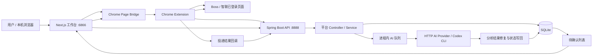
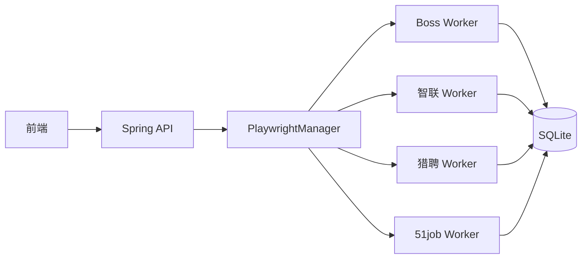
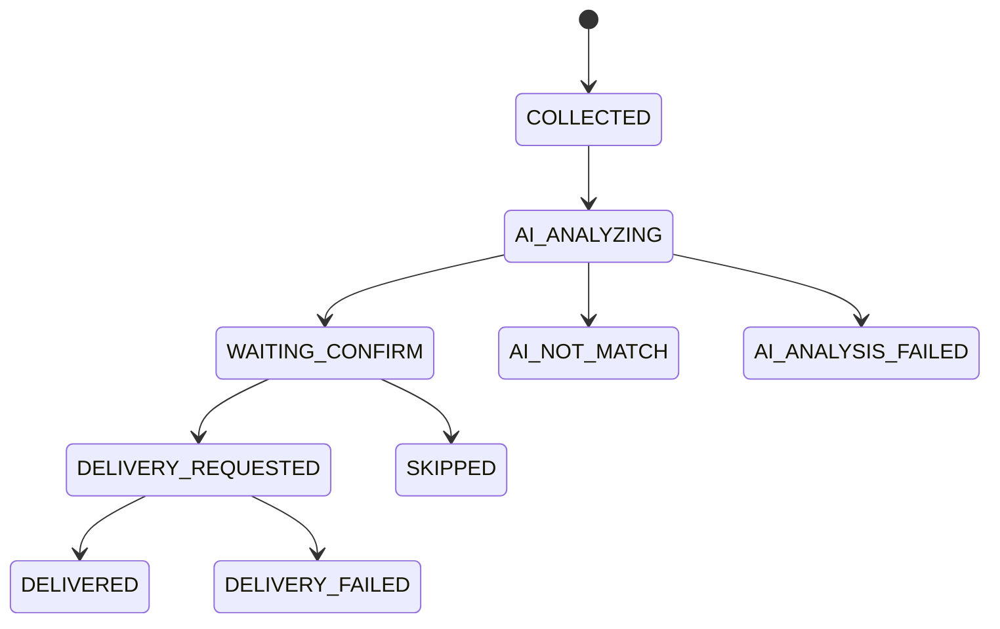
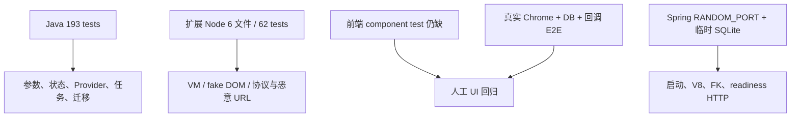
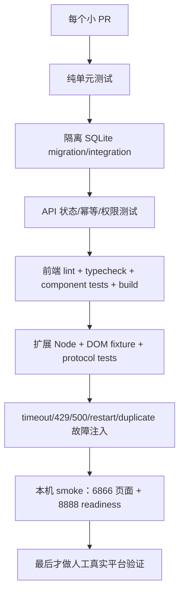

# PROJECT AUDIT — 投递牛马 AI-JobPilot V1

> 审计日期：2026-08-24
> 整改复评日期：2026-08-25
> 审计方式：Codemap 全量模块地图 + Code Overhaul 全量工程审计 + 本地 SonarQube Community Build 静态扫描
> 复评范围：已完成 P0.1–P1.6 与 P2.1；不访问真实招聘网站、不调用真实 AI Provider、不发送真实投递、不打开或修改现有业务数据库。

## 0. 结论先行

### 当前等级

**稳定 V1（限定为本机、单用户、人工在环）**。

它已经跨过“能跑但主要靠运气”的阶段：核心链路保持接通，同时增加了本机安全边界、Flyway 迁移阻断、持久任务与投递 attempt、终态 compare-and-set、Provider 超时/退避、Profile 数据隔离、严格 URL/静态资源边界、真实 readiness、UNKNOWN 对账/显式重试以及核心故障测试。

它仍不是生产级或对外 SaaS。当前评级依赖以下明确边界：

1. 只有一个可信用户在本机使用；
2. 招聘网站 DOM、登录态和浏览器行为仍需人工真实平台回归；
3. 对外网络、多用户认证授权、租户隔离不在本轮产品范围；
4. 历史数据库升级必须先在副本演练，V8 对无法确定归属的多 Profile 旧数据会主动失败；
5. UNKNOWN 表示“真实动作结果无法证明”，需要用户在对账入口明确确认或批准重试。

### 总健康度

**80 / 100**

这是“在明确本机边界内已经稳定，但仍有显著维护债”的分数。分数提升来自真实故障边界被封住，而不是 Sonar 数字变漂亮：旧库迁移失败会阻止启动，投递/AI 任务可恢复，跨 Profile 数据由数据库约束保护，Provider 与 URL/文件边界受限，UNKNOWN 有可审计恢复入口，CI 开始覆盖迁移、启动、扩展和前端契约。God Component、双执行链、低综合覆盖率和真实平台 E2E 仍阻止它进入“接近生产级”。

### 最重要的判断

- **为什么现在能跑：** Chrome 扩展复用已登录页面，Spring 单体与 SQLite 降低部署复杂度，各平台保留必要 DOM/API fallback；这些仍是合适的 V1 选择。
- **哪些已经可靠：** 本机认证/loopback 边界、迁移启动阻断、AI 持久任务、Provider 有界失败、投递 attempt/终态保护、Liepin/51job Profile 约束、HTTPS host allowlist、静态文件根边界、readiness 和 UNKNOWN 对账均有自动化保护。
- **哪些仍需人工：** 招聘网站真实 DOM 与平台确认信号、Chrome 安装态/登录态、历史真实库副本迁移、四平台完整 E2E；这些没有被单元测试伪装成“已真实验证”。
- **下一原则：** 不再继续堆功能；先做真实旧库副本演练和一次受控平台 smoke，再处理 P2 的 God Component、查询下推和测试覆盖缺口。

---

## 1. 审计范围、证据与限制

### 1.1 已覆盖范围

- Java/Spring Boot API、Service、MyBatis/SQLite、Flyway、Playwright Worker；
- Next.js/React 前端页面、配置、分析与确认投递界面；
- Chrome Extension 的 background、page bridge、Boss/智联 content scripts；
- AI Provider、Codex CLI、Prompt/JSON 修复、队列与状态写回；
- Gradle、pnpm、Docker、Windows 启动脚本、GitHub Actions、文档和 demo；
- 15 个功能模块，52,425 行、233 个文件。

### 1.2 整改复评没有做

- 没有真实登录招聘网站或发送简历；
- 没有调用会计费的 AI Provider 或已登录 Codex CLI；
- 没有对真实业务数据库执行迁移、查询或清理；迁移只在隔离临时 SQLite 中执行；
- 没有验证真实多用户、互联网暴露或 SaaS 部署；
- 没有删除 Dead/Legacy Code；
- 没有为了评分批量修改 Sonar smell 或补“凑百分比”的测试。

### 1.3 证据置信度

| 等级 | 含义 |
|---|---|
| 高 | Codemap、人工 Review、SonarQube/测试中至少两方一致，或代码路径可直接证明 |
| 中 | 人工 Review 与模块审计一致，但需要真实故障注入确认发生频率 |
| 待验证 | 静态代码显示风险，但必须用隔离运行/攻击样例确认，不能直接称为已发生漏洞 |

---

## 2. 项目架构图：整个系统怎么跑

### 2.1 当前主业务链



### 2.2 仍在运行的旧链



当前实际状态不是“一套统一平台架构”，而是：

- Boss、智联：Chrome Bridge 是主链，旧 Playwright 代码仍部分接线；
- 猎聘、51job：仍主要依赖 Playwright；
- 前端、扩展、后端各自保留平台特化状态和兼容格式；
- `application/platform` 有抽象雏形，但尚未成为所有平台的真实执行边界。

这解释了项目为什么能够兼容不同阶段的实现，也解释了为什么一次改动可能同时影响页面、扩展消息、后端状态、数据库和旧 Worker。

### 2.3 核心状态流



上图是应有的逻辑模型；当前代码没有在数据库层统一强制这些合法转换。重复/延迟回调可以直接覆盖终态，旧 Worker 还会在没有真实发送确认时直接写 `DELIVERED`。

### 2.4 Codemap 模块清单

| 模块 | 职责 | 耦合 | LOC | 分数 | 主要 Blast Radius |
|---|---|---:|---:|---:|---|
| 前端壳与配置中心 | 首页、档案、配置、SSE/API helper | 高 | 3,246 | 68 C | 所有页面与敏感配置 |
| 平台扫描控制页 | 四平台登录、扫描、停止、进度 | 高 | 4,179 | 58 D | 平台运行状态与用户操作 |
| 分析与确认投递界面 | 统计、筛选、确认、批量投递 | 核心 | 5,111 | 55 D | 状态判断和真实投递 |
| Chrome Bridge 网关 | 消息、导航、回调、协议 | 核心 | 1,839 | 58 D | 扩展全部采集/投递 |
| Boss 扩展适配器 | API/DOM 多级采集、恢复、投递 | 核心 | 6,012 | 52 D | Boss 全链路 |
| 智联扩展适配器 | DOM 采集、恢复、投递 | 高 | 3,230 | 50 D | 智联全链路 |
| API 运行时与共享契约 | CORS、健康、配置、Cookie、DTO | 核心 | 1,673 | 43 D | 全局安全与运行入口 |
| Boss 后端业务 | 配置、入库、统计、状态 | 核心 | 4,221 | 55 D | Boss 数据与投递 |
| 智联后端业务 | 配置、入库、队列、状态 | 核心 | 2,134 | 50 D | 智联数据与投递 |
| 猎聘与 51job 后端 | 旧平台配置、入库、统计 | 高 | 2,680 | 42 D | 旧平台与多档案数据 |
| AI 分析与 Provider | Prompt、Provider、队列、写回 | 核心 | 3,028 | 52 D | 费用、判断与所有平台状态 |
| 数据与配置基础 | Schema、Profile、Config、Cookie | 核心 | 861 | 45 D | 全库数据一致性 |
| Playwright 运行时 | Browser/Page 生命周期、Cookie、锁 | 核心 | 3,416 | 55 D | 四平台浏览器状态 |
| 旧平台 Playwright Worker | 搜索、分析、投递执行 | 高 | 4,456 | 43 D | 旧平台真实动作与状态 |
| 构建、交付与文档 | Gradle/pnpm/Docker/CI/文档 | 中 | 6,339 | 61 C | 可复现构建与发布判断 |

完整交互地图见 `.codemap/codemap.html`，文本版见 `.codemap/codemap.md`。

---

## 3. 项目健康度

| 维度 | 分数 | 依据 |
|---|---:|---|
| 架构合理性 | 7/10 | 本地单体 + SQLite 继续符合 V1 规模；任务、投递 attempt、readiness 与平台数据边界已经落地，但 Chrome/Playwright 双链和 God Service 仍存在 |
| 业务逻辑 | 9/10 | 核心流程完整；重复/延迟结果受终态保护，UNKNOWN 不再伪装成功，并有人工对账与显式重试。真实平台成功信号仍需人工验证 |
| 代码质量 | 6/10 | 类型、命名和失败契约改善；Sonar 仍有 1,336 smells，多个 1,000–4,700 行文件及平台复制，暂未为评分强拆 |
| 数据设计 | 9/10 | Flyway 是迁移真相，失败阻止启动；V8 为猎聘/51job 增加 profile FK 与复合唯一约束，SQLite 每连接启用 FK；其余历史表约束仍需逐表收敛 |
| 稳定性 | 9/10 | AI 任务可重启恢复，Provider 有总超时/有界重试，投递有 attempt/幂等/对账，readiness 覆盖 DB/Schema/队列；外部网站仍不可控 |
| 测试 | 8/10 | 193 个 Java 测试、62 个扩展测试、真实 Spring 启动 + 临时 SQLite 集成、CI 覆盖 lint/typecheck/build/扩展；前端组件和真实浏览器 E2E 仍缺 |
| 安全性 | 8/10 | 服务与 Secret 收紧到本机令牌边界，招聘 URL 强制 HTTPS 精确域名，静态资源防穿越，Next 生产依赖审计为 0；Sonar 仍需人工分诊动态 SQL/临时目录 |
| 性能与资源 | 7/10 | 队列/重试/AI 成本边界已受控；整表载入、超大脚本和旧 Worker 固定等待仍会随数据量放大 |
| 可观测性 | 8/10 | liveness/readiness 分离，任务/attempt/UNKNOWN 可查询，错误状态更明确；尚无长期指标、分布式 trace 或真实平台回执遥测 |
| 文档与可维护性 | 9/10 | Code Map、审计、分轮任务、CI 和回滚边界齐全；旧文档与双执行链说明仍需持续收敛 |
| **总分** | **80/100** | **稳定 V1（本地单用户边界）；不是生产级或对外 SaaS** |

---

## 4. SonarQube 客观指标

<!-- SONAR_RESULTS_START -->

### 4.1 扫描指标与人工分诊

扫描环境：本机 SonarQube Community Build **26.8.0.126808**；最终分析 ID `57d5cabe-1069-4099-97e4-4a6f3e9ad593`，版本 `1.3.0-stable-v1-completion`。临时分析 Token 已在 `finally` 中撤销，扫描后再次确认撤销成功；未写入仓库或报告。

扫描使用编译产物和 JaCoCo XML，但日志提示未提供完整 `sonar.java.libraries` / `sonar.java.test.libraries`，并有 unresolved type/import/preview feature 警告；扩展 VM 测试也无法生成有效 LCOV。因此总体指标适合做热点排序，不能把每个 Java/JS 告警直接当成已证实缺陷。

| 指标 | 结果 | 判断 |
|---|---:|---|
| 分析代码行 `ncloc` | 44,812 | 不含测试、文档和生成物后的 Sonar 口径；本轮新增任务/状态/迁移与恢复入口导致 LOC 增长 |
| Bugs | 26 | 未解决口径；含 2 个 Blocker，必须人工按真实控制流重排 |
| Vulnerabilities | 64 | Security Rating D；44 个来自动态 SQL 规则，另含临时目录、PATH 搜索和伪随机规则，不能全当作可利用漏洞 |
| Security Hotspots | 0 | 不代表没有安全风险；本轮人工 Review 发现了 Sonar 未表达的无认证信任边界 |
| Code Smells | 1,336 | 主要集中在重复字面量、空 catch、嵌套 try、认知复杂度和嵌套三元表达式 |
| Duplication | 8.4% | 跨平台 Controller/Service/UI 重复与人工 Review 一致；本轮没有为降低指标强做超级抽象 |
| Coverage | 19.6% | Sonar 全语言口径：line 18.7%、branch 22.1%；Java JaCoCo 已导入，前端与扩展仍无有效覆盖输入 |
| Cognitive Complexity | 9,508 | 与 Codemap 的 God Component 热点高度重合 |
| Cyclomatic Complexity | 11,891 | `boss-content.js` 单文件 1,709，智联 content 1,036 |
| Maintainability Rating | A | 债务率 1.1%；该评级会被大量 LOC 稀释，不能覆盖业务风险 |
| Reliability Rating | E | 26 个未解决 Bugs；最高严重度仍由旧 Playwright 持锁等待触发 |
| Security Rating | D | 64 个未解决 Vulnerabilities；需要逐项确认输入是否可控和部署边界 |
| Technical Debt | 15,112 分钟 | 约 251 小时 52 分钟，约 31.5 个 8 小时工作日 |
| Quality Gate | **OK，但不足以作为发布通过** | 最终扫描相对同版本前一次扫描只看到极小增量，因此新代码 Coverage 100%、重复率 0%、新增问题 0；同一工作树在版本切换前曾因新代码 Coverage 9.7%、重复率 3.78%、新增问题 239 显示 ERROR。短窗口 OK 不能掩盖总体 E/D 评级和低覆盖 |

未解决问题共 1,426 个：2 Blocker、345 Critical、641 Major、366 Minor、72 Info；按类型为 26 Bugs、64 Vulnerabilities、1,336 Code Smells。Sonar 数量增加主要由代码范围增长、规则/门禁生效和新增恢复逻辑引起，不代表本轮把系统改得更不稳定；但它明确说明“业务风险收口”不等于“代码维护债已经解决”。

### 4.1.1 最复杂文件

| 文件 | Cognitive | Cyclomatic | Duplication | Coverage |
|---|---:|---:|---:|---:|
| `chrome-extension/boss-content.js` | 839 | 1,709 | 7.7% | 0% |
| `chrome-extension/zhilian-content.js` | 633 | 1,036 | 15.1% | 0% |
| `PlaywrightManager.java` | 563 | 363 | 10.0% | 2.4% |
| `worker/boss/Boss.java` | 520 | 312 | 0% | 0% |
| `chrome-extension/background.js` | 407 | 720 | 9.0% | 0% |
| `BossService.java` | 375 | 427 | 11.0% | 23.3% |
| `front/app/boss/page.tsx` | 357 | 499 | 9.3% | 0% |
| `worker/job51/Job51.java` | 396 | 174 | 1.2% | 0% |
| `Job51Service.java` | 288 | 230 | 9.0% | 12.2% |
| `JobAiAnalysisService.java` | 258 | 284 | 7.7% | 67.9% |

### 4.1.2 重复率最高的主要文件（至少 100 NCLOC）

- `ZhilianJobService.java` 37.7%；
- `BossJobService.java` 35.7%；
- `LiepinController.java` 35.6%；
- `BossChartPanel.tsx` 30.9%；
- `JobController.java` 30.4%；
- `front/app/liepin/page.tsx` 28.9%；
- `BossKpiCards.tsx` 28.5%；
- `LiepinService.java` 27.5%。

这些位置与 Code Overhaul 发现的“四平台复制”和旧 Worker 双实现一致，因此属于高置信度技术债；但应优先统一状态/幂等/错误契约，不应为了降低百分比抽取一个超级基类。

### 4.1.3 值得优先处理的 Sonar 问题

| 规则/数量 | 人工判断 |
|---|---|
| `java:S2259` 1 个 | `ExternalToolSupport.java:44` 可能对 nullable `detail` 解引用；小成本真实 Bug，P1/P2 早期修 |
| `java:S2142` 4 个 | 捕获中断后未恢复中断标记，会破坏取消/关闭语义；值得在 P2 小轮修复 |
| `java:S2276` 2 个 Blocker | `PlaywrightManager:713,767` 在 synchronized 区域 sleep，持锁等待会阻塞其他页面操作；真实并发问题，但业务优先级低于数据/投递 P0 |
| `java:S2077` 44 个 | 动态 SQL 主要集中在迁移/Schema/统计代码；常量表名场景可能是假阳性，任何用户可控值进入拼接的路径必须逐条审计 |
| `java:S5443` 3 个 Critical | Codex/旧 Boss Worker 使用系统临时目录；当前 read-only/及时删除降低风险，但应改为用户私有目录并验证权限 |
| `java:S5693` 2 个 | 30 MB 上传阈值超过规则建议，和一次性内存读取组合后值得限制/流式化 |
| `docker:S6471` 1 个 | 容器默认 root；开发 Compose 风险较低，若作为发布镜像则应建立非 root 用户 |
| `S3776` Java 65 个（另有 JS/TS） | 与 Codemap 最差文件高度重合，适合在特征测试后按模块拆分 |

### 4.1.4 不应机械修复的 Sonar 问题

- `java:S1192` 重复字符串 242 个：大量是状态、字段、平台选择器；先集中协议常量，不能批量抽取无语义常量。
- `java:S108` 空 catch 121 个：业务写入/投递路径上的要修；关闭页面、读取可选标题等 best-effort 路径可以保留但应注释原因。
- `S2245` 伪随机 9 个：当前多数用于 request id、抖动或本地 UI key，不是密码学令牌；不要一律换成重型方案，只有安全 token 才用 CSPRNG。
- `java:S2119` 2 个被标 Critical 的重复 `new Random()`：属于质量/性能问题，不是本项目的 P0 业务缺陷。
- `typescript:S1082` 10 个交互可访问性问题：真实体验问题，归 P2/P3，不应压过数据与状态整改。
- 嵌套三元、命名、wrapper 等 smell：能读懂且稳定的代码不为评分而改。

<!-- SONAR_RESULTS_END -->

### 4.2 Sonar 结果如何使用

- 值得修：真实控制流错误、空指针/资源泄漏、敏感数据暴露、路径/命令边界、复杂度与业务热点重合、重复代码导致平台行为漂移。
- 低价值：只影响格式/命名、修改后增加 wrapper、仅为降低重复率而抽出难懂抽象、对当前单机 V1 没有运行风险的规则偏好。
- Coverage 不作为 KPI 单独优化。优先覆盖“投递状态、AI 队列恢复、Schema 迁移、重复请求、Provider 超时”这些核心失败边界。

---

## 5. 构建、测试与 Coverage 实测

<!-- VALIDATION_RESULTS_START -->

所有后端测试使用独立 SQLite、data/output/cache/log 路径，并显式关闭浏览器自动初始化和静态附加端口；没有访问真实招聘网站或真实 Provider。

| 检查 | 结果 | 说明 |
|---|---|---|
| Gradle `clean test + jacocoTestReport` | 通过 | 193 tests：189 通过、4 跳过、0 失败；含真实 Spring 随机端口 + 临时 SQLite 启动集成 |
| Java JaCoCo | 核心覆盖提升、总体仍偏低 | 行 31.03%、分支 22.10%、指令 32.52%、方法 39.86%、复杂度 18.45%、类 70.47% |
| 前端 lint | 通过但有警告 | 0 errors、35 warnings；主要是既有未使用变量、React Hook 依赖和浏览器数据过期提示 |
| TypeScript `tsc --noEmit` | 通过 | 0 错误 |
| Next 16.3.2 build | 通过 | 13/13 静态页面生成 |
| 扩展测试（显式文件） | 通过 | 6 个 `*.test.cjs`，62 tests 全通过，0 失败；Linux CI 使用 shell glob，Windows 验证用明确文件列表 |
| 扩展 LCOV | 无效 | 生成文件仅 4 字节 `TN:`，没有可归因覆盖条目；Sonar 因此把扩展计为 0% |
| Extension manifest/语法校验 | 通过 | 15 个引用文件、11 个 JS 语法检查通过 |
| `pnpm audit --prod` | 通过 | `No known vulnerabilities found` |
| Docker Compose 配置 | 通过 | `docker compose config` 退出码 0，0 warning |
| Sonar 扫描执行 | 通过 | 44,812 NCLOC，CE 成功处理，临时 token 已撤销；最终 Gate 的 3 条条件只覆盖最后一个极小增量窗口，不能当作整体发布门禁，详见第 4 节 |
| 真实业务数据库保护 | **待归因** | 最终测试未打开数据库，且文件修改时间早于最终 Operator 验证；但当前 SHA/大小/mtime 与 2026-08-22 基准不同。未覆盖、未回滚，发布前必须由用户确认这是否为预期运行产生的变化 |
| 残留服务 | 通过 | 6866 无监听；最终测试没有启动独立后端服务 |

真实 DB 只读指纹证据：

| 口径 | Size | LastWriteTimeUtc | SHA256 |
|---|---:|---|---|
| 2026-08-22 基准 | 10,579,968 | `2026-08-22T10:15:11.7688626Z` | `567B10BF197CC37B6E4E6B81C05ACE3FC6D709CD4B29E1C89A3294BF10403172` |
| 本轮最终检查 | 10,752,000 | `2026-08-24T14:23:27.7431953Z` | `17B63982FFBF90AB33FA716C533F5C98DBCE1851CE060D40D156A0468CC5058B` |

第二次完整测试明确采集了 BEFORE/AFTER：size、mtime、SHA256 完全一致，且无 `-wal/-shm` 与 8888 监听；这能证明最终验证没有再次写库，不能证明更早变化的责任归属。

### 5.1 前端依赖安全复评

- `next`：16.3.2；
- `react` / `react-dom`：19.2.8；
- `tailwindcss-animate` 已移入 `devDependencies`，不再扩大生产依赖口径；
- `pnpm install --frozen-lockfile`、lint、typecheck、13 页面 build 全部通过；
- `pnpm audit --prod`：0 个已知漏洞。

这表示 P1.6 的已知生产依赖问题已关闭，不表示未来无需升级。Next/React 与 Tailwind major 仍应分轮，新的 advisory 进入依赖维护流程，不与业务重构混在一起。

<!-- VALIDATION_RESULTS_END -->

### 5.2 当前测试拓扑



### 5.3 目前完全或主要依赖人工验证的核心流程

1. 真实招聘页面 DOM/API 变化后的扫描；
2. 扩展导航、断点恢复、跨页面 `chrome.storage` checkpoint；
3. 点击投递后招聘平台是否真正接受；后端重复/延迟/UNKNOWN 语义已有自动化，但平台回执仍需人工；
4. 真实旧 SQLite 副本从历史状态升级到 V8；临时构造矩阵已自动化；
5. 前端 partial/error/UNKNOWN 的像素与交互体验；后端 API 契约已有自动化；
6. 多平台同时运行时共享 BrowserContext 的并发行为；
7. Chrome 扩展实际安装 ID、真实登录态和网站 DOM 更新后的端到端行为。

---

## 6. 交叉验证后的问题总表

说明：`C`=Codemap，`O`=Code Overhaul，`S`=SonarQube。Sonar 未命中的业务语义问题不会因此降级；静态规则未产生业务影响时也不会机械升级。

### 6.1 整改复评台账

| 原问题 | 当前状态 | 复评证据 |
|---|---|---|
| SEC-01 本机敏感接口边界 | **已关闭** | 服务强制 loopback；敏感接口使用本地令牌与白名单；Secret 不再通过 GET 原文返回 |
| DATA-01 多轨/在线破坏性 Schema | **已关闭** | 一次性迁移收敛到 Flyway；完整 Schema 校验失败阻止启动；迁移故障与旧库矩阵使用临时库测试 |
| BIZ-01 / EXT-02 投递真实性与幂等 | **已关闭** | `delivery_attempt`、request key、CAS 终态、UNKNOWN、人工对账和显式重试已覆盖四平台 |
| AI-01 / AI-02 持久任务与原子写回 | **已关闭** | 持久任务、租约、启动恢复、失败态和清理安全已落地 |
| AI-03 Provider 超时/退避/成本 | **已关闭** | 总超时、Retry-After、有界重试、请求 ID、脱敏错误与坏输出失败态已落地 |
| DATA-02 Liepin/51job Profile 隔离 | **已关闭** | V8 增加 `profile_id`、surrogate id、复合唯一键、Profile FK；服务查询/更新和 attempt 全链带 Profile |
| DATA-03 全库约束 | **部分关闭** | Liepin/51job 已有 FK/UNIQUE；其余历史表仍需在真实旧库画像后逐表收敛 |
| EXT-01 / API-01 URL 与静态文件边界 | **已关闭** | HTTPS 精确根/子域白名单、未知扩展 CORS 拒绝、canonical root containment、畸形 URI 400；恶意样例测试通过 |
| API-02 Readiness | **已关闭** | `/api/health` 保持 liveness；`/api/ready` 检查 DB、完整 Schema 与队列且失败返回 503，不发起计费探测 |
| SEC-02 Next 安全升级 | **已关闭** | Next 16.3.2、React 19.2.8；13 页面构建通过；`pnpm audit --prod` 为 0 |
| TEST-01 核心故障自动化 | **核心范围已关闭** | 迁移、Profile/attempt、readiness、HTTP 恢复、静态边界、真实 Spring 启动 + 临时 SQLite、扩展协议已进测试/CI；真实平台 E2E 仍保留为 P2 |

### 6.2 当前未关闭问题

| ID | 优先级 | 问题 / 位置 / 模块 | 来源 | 原因与实际影响 | 概率 | 修改收益 | 成本 / 风险 | Blast Radius | 推荐方案 |
|---|---|---|---|---|---|---|---|---|---|
| REAL-01 | P1 | 真实平台确认与历史库副本尚未做受控 smoke；四平台 + V8 | O | 自动化证明了协议和失败语义，但没有证明当天网站 DOM、登录态和真实旧库数据可直接工作；上线前仍可能遇到平台变化或历史数据归属失败 | 中 | 高 | M / 涉及真实账号与备份，风险中 | 四平台真实操作、历史数据 | 在用户确认后，用数据库副本先演练 V8；每平台只做 1 个明确目标 smoke，记录页面证据、request key 与后端状态，不纳入 CI |
| PW-01 | P2 | 共享 BrowserContext 与旧 Worker；`PlaywrightManager`、`worker/*` | C+O+S | 猎聘/51job 仍依赖旧链；共享 context、固定等待和站点 fallback 使并发恢复难预测 | 中 | 高 | L / 真实站点回归风险高 | 四平台浏览器运行 | 保持单用户串行边界；先修持锁 sleep 与中断，再按平台收敛 context 恢复；不要整体重写 |
| ARCH-01 | P2 | God Component/Service；`boss-content.js`、`zhilian-content.js`、`background.js`、`BossService` | C+O+S | 最高认知复杂度 839，协议、状态、I/O、UI 混合；小改动容易跨模块扩散 | 高 | 高 | L / 回归风险高 | Boss、智联、AI 与 UI | 依托现有特征测试，按纯解析 helper → reducer → client/repository 小步拆分；每轮只拆一个模块 |
| ARCH-02 | P2 | Chrome 主链与 Playwright 旧链并存 | C+O | 双实现是现阶段兼容资产，但状态和成功语义容易再次漂移 | 高 | 中高 | L / 删除风险高 | 四平台 | 先记录唯一正式执行链与遥测；猎聘/51job 完成 Chrome 迁移并观察后再删除旧链 |
| TEST-02 | P2 | 前端组件/真实浏览器 E2E 覆盖不足；`front/**`、`chrome-extension/**` | O+S+Coverage | Java 核心故障覆盖已提升，但 Sonar 综合覆盖仅 4.3%，前端与 VM 扩展没有有效 LCOV；UI partial/error 仍主要人工验证 | 高 | 高 | M-L / 低 | 每次 UI、协议和站点改动 | 优先补 component/contract 和离线 DOM fixture；真实投递只做人工受控 smoke，不追求虚假总百分比 |
| SONAR-01 | P2 | 26 Bugs / 64 Vulnerabilities / 1,336 Smells；主要在旧 Worker、动态 SQL、临时目录 | S+O | `S2276` 持锁 sleep、`S2259` nullable、`S2142` 中断等值得修；大量常量表名 SQL、重复字面量和空 catch 需人工区分 | 中 | 中高 | M / 批量修复风险高 | Worker、迁移、维护成本 | 先修可证明的控制流/临时目录边界；动态 SQL逐条确认输入；其余进入模块小轮，不把 Sonar 当自动修复清单 |
| DATA-04 | P2 | 其余历史表 FK/UNIQUE 仍不完整；V1–V8 数据层 | C+O | 本轮只为 Liepin/51job 完成严格 Profile 约束，旧表仍可能依赖服务层清理/唯一性 | 低至中 | 中高 | M-L / 旧库风险高 | Profile 生命周期、旧历史数据 | 先对真实库副本生成重复/孤儿矩阵；一次只迁移一个主题并 fail-closed |
| PERF-01 | P2 | 列表/统计整表读取；四平台 Service/页面 | C+O | 数据增长后 CPU、内存和延迟线性上升；当前小数据下尚无线上慢查询证据 | 中（随数据量增长） | 中 | M / 低中 | 分析页、导出、统计 | 先记录查询规模与耗时，再把稳定过滤/分页下推 SQL，并只加有证据的复合索引 |
| OBS-01 | P2 | 缺少长期指标与真实平台回执遥测；readiness/日志/attempt | C+O | 当前能判断系统是否 ready、任务是否 UNKNOWN，但缺少趋势、告警和真实平台证据关联 | 中 | 中 | M / 低 | 故障定位、费用与平台变化 | 为 request/task/attempt 统一 correlation id；记录有限状态指标，不记录 Token/Cookie/完整 AI 响应 |
| ENV-01 | P2 | 共享本机 SonarQube 仍使用默认管理员凭据 | S+环境核验 | 仅绑定 loopback 时外部风险较低，但任何本机进程都可能管理扫描服务；与产品运行无直接关系 | 低至中 | 中 | S / 共享环境影响中 | 本机 Sonar 项目与扫描历史 | 由机器维护者改默认密码并继续保持 loopback；不得删除共享 volume 或将凭据写入仓库 |
| DOC-01 | P3 | 多代文档、demo 与旧入口 | C+O | 新维护者仍可能误选过期流程；当前不影响核心运行 | 中 | 低中 | S / 低 | 上手与维护 | 标记 current/legacy/archive；确认调用图后再删，不做目录美化式大迁移 |

### 6.3 原始审计问题（历史基线）

下表保留整改前的原因、影响和原始优先级，供追溯使用；当前状态以 6.1/6.2 为准，不能再把其中已关闭项解释为当前未修复问题。

| ID | 优先级 | 问题 / 位置 / 模块 | 来源 | 原因与实际影响 | 概率 | 收益 | 成本 / 修改风险 | Blast Radius | 推荐方案 |
|---|---|---|---|---|---|---|---|---|---|
| SEC-01 | P0 | 无认证敏感配置/Cookie/进程执行链；`ConfigController:28-151`、`CookieController:30-56`、`CodexCliService:134-180`；API/AI | C+O | 原生后端未强制 loopback；API 可读写敏感配置并允许改变可执行路径，随后 AI 接口可启动该文件。若 LAN/公网可达，可能泄密或执行任意本机程序 | 中（严格本机低，暴露后高） | 极高 | M / 配置兼容风险中 | 全部账号、AI 密钥、本机进程 | 先绑定 `127.0.0.1`，再对白名单配置提供只写不回显 API；敏感/副作用接口加本地认证令牌，禁止任意可执行路径 |
| SEC-02 | P1 | 前端依赖存在 critical/high advisory；`front/package.json` / lockfile | 依赖审计 | `next@16.0.1` 命中 React Flight RCE critical，另有多项 RSC/Server Actions/DoS advisory；当前静态导出降低部分服务端可利用面，但 dev server/未来部署仍有风险 | 中 | 高 | M / 前端回归风险中 | 前端运行与构建供应链 | 单独升级到同 major 已修复版本；验证 13 页面、代理、静态导出和 Windows 启动；不要同时升级 Tailwind major |
| DATA-01 | P0 | 在线 DROP/重建与多套 Schema 真相；`DatabaseSchemaService:21-39,420-436`、`BossService:535`；数据/Boss | C+O | 启动/reload 可在无完整事务下重建表，异常只 warn 并继续；中断可能缺表、半迁移或数据丢失 | 低至中 | 极高 | L / 数据迁移风险高 | 全库或 Boss 核心表 | 先备份并快照真实 Schema；把一次性迁移移入 Flyway；旧库做幂等升级测试；失败必须阻止启动 |
| BIZ-01 | P0 | 投递假成功与无约束回调；`Job51:244-299,680-727`、`Liepin:550-577`、`BossAnalyticsController:239`、`ZhilianController:550` | C+O | “按钮存在/点击过/页面像聊天页”被当作已投递；重复或延迟回调可覆盖终态。用户可能认为简历已发，实际未发 | 中（旧平台高） | 极高 | L / 业务兼容风险中高 | 四平台投递与统计 | 建立持久化状态机、幂等键和 compare-and-set；只有平台明确确认才写 DELIVERED，未知结果写 UNKNOWN/PENDING_RECONCILE |
| AI-01 | P1 | AI 队列不可持久化恢复；`ChromeJobAnalysisQueueService:25-112` | C+O | 队列和去重全在内存；重启丢任务并遗留 `AI_ANALYZING`；失败任务仍进入 completed key | 中 | 高 | M / 中 | 四平台 AI 分析 | 先增加任务表/租约/重试状态和启动对账；再让线程池只执行已持久化任务 |
| AI-02 | P1 | AI 写入非原子、坏输出降级为 SKIP；`JobAiAnalysisService:207,302,439-461` | C+O | 历史分析与平台缓存分开写；持久化失败被吞，错误 JSON 可能变 score=0/SKIP | 中 | 高 | M / 中 | 决策准确性与审计记录 | 单事务写分析与状态；解析失败进入明确失败态并保留脱敏原文，禁止静默转业务跳过 |
| AI-03 | P1 | Provider 无完整超时/退避，fallback 可重复计费；`AiService:66,130,366-385` | C+O | 只有 connect timeout；429/5xx 无 Retry-After；reasoning 错误会发第二次完整请求；日志包含完整响应体 | 中 | 高 | S-M / 低中 | 线程、费用、敏感日志 | 为每次请求设置总超时；仅对明确可重试错误做有界退避；计费请求使用 request id；日志只留状态、trace id、截断摘要 |
| DATA-02 | P1 | Profile 隔离不完整；`LiepinConfigEntity`、`Job51ConfigEntity` 无 `profile_id` | C+O | 猎聘/51job 取全局第一条配置并读取整表，多档案会共享配置和岗位状态 | 高（只要使用多档案） | 高 | L / 数据迁移风险高 | 两平台历史数据与档案删除 | 先制定历史归属规则并备份；分轮为配置、岗位、状态加 profile；补唯一约束和隔离测试 |
| DATA-03 | P1 | 缺少 FK/UNIQUE/原子 upsert；`V1__init_schema.sql`、`ZhilianService:278`、Config/Cookie Service | C+O | 跨扫描相同岗位可重复；config/cookie 并发产生重复；删除 Profile 留孤儿 | 中 | 高 | L / 旧数据清洗风险高 | 全库一致性 | 先做只读重复/孤儿报告，再清洗、加约束；upsert 使用 DB 原子语义；为删除定义 RESTRICT/CASCADE 策略 |
| EXT-01 | P1 | 招聘域名用 `endsWith`，可接受 lookalike host；Boss/Zhilian support/content | C+O | `evilzhipin.com`、`evilzhaopin.com` 可能通过校验并进入导航/采集/投递 | 低至中 | 高 | S / 低 | 扩展导航和用户信任 | 统一 `hostname === root || hostname.endsWith('.'+root)` 且强制 HTTPS；用恶意 host 单元测试固定边界 |
| API-01 | P1 | 静态资源 Resolver 可能越界；`StaticResourceConfiguration:65-99` | O，待动态验证 | 自定义 `createRelative(resourcePath)` 直接返回 readable resource，未见标准 `checkResource` 边界校验；存在路径穿越可能性，但本轮未做攻击请求 | 待验证 | 高 | S-M / 低 | 本机文件读取 | 在隔离服务用编码后的 `..` 变体做回归；无论复现与否都改用标准 resolver 边界检查并限制静态根 |
| API-02 | P1 | 假健康检查；`HealthController:29-50`、`ConfigController:159-167`、`ZhilianController:720-726` | C+O | 返回 UP/healthy 不证明 DB、队列、AI、扩展或浏览器可用，自动化可能在系统未就绪时继续 | 高 | 高 | S / 低 | 启动、运维、用户判断 | 分 liveness/readiness；readiness 检查 DB、Schema、队列容量与必要配置，外部 Provider 只报配置/近期状态，避免实时计费探测 |
| EXT-02 | P1 | POST 自动重试没有幂等键、回调失败被忽略；`background.js:435-480,975-1003` | C+O | 网络不确定时整批岗位可重复入库/入队；投递已执行但回写丢失会产生半成功 | 中 | 高 | M / 中 | 扫描批次、AI 费用、投递状态 | `runId + batchIndex + payloadHash` 幂等；回调写 outbox/待对账；UI 展示 unknown 而非 success |
| PW-01 | P1 | 共享 BrowserContext 并发与恢复不完整；`PlaywrightManager:237-250,478-529` | C+O | 四平台并发操作同一 context；浏览器崩溃后只新建 Page，未重放 Cookie/导航/登录校验 | 中 | 高 | L / 中高 | 四平台旧链 | 在保留旧链期间先串行化 context 操作并实现统一重建流程；不要立刻重写所有 Worker |
| ARCH-01 | P2 | 多个 God Component/Service | C+O+S（若复杂度重合） | `boss-content.js`、`PlaywrightManager`、`BossService`、BossPage、智联分析页同时承担协议、状态、I/O、UI | 高（每次维护） | 高 | L / 重构风险高 | 多模块 | 先写特征测试；按数据边界逐次抽取纯函数、状态 reducer、Repository/Provider adapter，每轮保持 API 不变 |
| ARCH-02 | P2 | Chrome 主链与旧 Playwright 链并存 | C+O | 兼容让项目能跑，但职责、状态和成功语义重复；旧 Boss/智联接口固定 410 但代码仍大量保留 | 高 | 中高 | L / 高 | 所有平台 | 先记录每平台唯一正式执行链；确认遥测和回退期限；猎聘/51job 迁移前不得删除旧链 |
| PERF-01 | P2 | 整表加载后内存过滤/分页 | C+O | Boss/Zhilian/Liepin/51job 的统计和列表使用 `selectList` 全量读取；数据增长后延迟/内存线性增加 | 中（随数据增长） | 中高 | M / 低中 | 分析页与导出 | 采样真实查询；补复合索引；把可表达过滤/分页下推 SQL；复杂薪资解析保留有界后处理 |
| TEST-01 | P2 | 核心失败边界无自动化 | C+O+Coverage | 前端 0 测试、无显式 Spring 集成测试；扩展主要 VM/fake DOM/源码断言；真实回调、重启、迁移靠人工 | 高 | 高 | M-L / 低 | 全项目变更安全 | 先补 8 条关键特征/故障注入测试，不追求全量百分比；CI 必须实际执行 extension tests 和 coverage |
| OBS-01 | P2 | 错误被转空数据、SKIP 或 success | C+O | 首页统计失败变 0、Stats 异常变空、Cookie 保存失败仍提示成功、批量失败仍 success | 高 | 高 | M / 低 | 用户判断、诊断 | 定义 `success/partial/failed/unknown` 响应契约与错误码；前端保留旧数据但明显标记 stale/error |
| OPS-01 | P2 | CI/启动/交付契约漂移 | C+O | 扩展测试未接 CI；release PR job 有 write；Docker 仅探测端口；多套静态交付路径并存 | 中 | 中 | S-M / 低 | 发布可信度 | CI 执行实际测试；权限按事件最小化；启动检查 HTTP+readiness；明确 dev Compose 与生产打包边界 |
| DOC-01 | P3 | 文档和 demo 多入口/旧方案 | C+O | 根目录、`doc/`、`docs/` 同时保留多代方案；demo 尚未接入但容易被误解 | 中 | 低中 | S / 低 | 新维护者理解 | 标注 current/legacy/archive，不立即删除；只保留一个运行入口索引 |

---

## 7. P0 / P1 / P2 / P3 汇总

### P0 — 必须先保护

**当前无未关闭 P0。** 原 SEC-01、DATA-01、BIZ-01 已通过 P0.1–P0.3 关闭，并有回归测试。若确认真实数据库的非预期变化由本轮工具造成，则必须立即重新打开 DATA P0；当前证据只能确认变化发生在最终 Operator 验证之前，不能擅自归因。

### P1 — 发布前门槛

- **REAL-01：** 在用户确认后完成历史数据库副本迁移演练和四平台各一次受控 smoke；
- 确认 `db/getjobs.db` 当前指纹变化是否为用户预期运行产生，未确认前不对真实库执行 V8；
- 真实验证只收集明确证据，不把“点击过”当成功，也不调用额外计费 Provider。

### P2 — 可持续开发

- 在特征测试保护下拆 God Component；
- 明确并逐步收敛双执行链；
- SQL 下推和索引；
- 补前端 component、离线 DOM fixture 与受控 E2E；
- 分诊 Sonar 中持锁等待、中断、nullable、临时目录和动态 SQL；
- 为其余历史表逐主题补约束；
- 增加 correlation id、有限状态指标与真实平台回执遥测。

### P3 — 低 ROI 清理

- 纯命名、目录美化和低影响 Sonar smell；
- 文档归档、demo 标记；
- 不影响行为的 wrapper/格式偏好。

---

## 8. 技术债 Top 10

排序按“风险 × 影响 × 未来维护成本 × 修改收益”，不是按代码是否难看。

| 排名 | 技术债 | 为什么排在这里 |
|---:|---|---|
| 1 | 真实平台/历史数据库尚未做受控验收 | 这是从“工程上稳定”到“用户真实可用”的最后证据缺口，不能用 mock 或构造库替代 |
| 2 | Boss/智联扩展 God Script | 最高认知复杂度 839/633，协议、状态、DOM 与回写混合，是未来站点变更的最大维护成本 |
| 3 | Chrome 与 Playwright 双执行链 | 双链保住了兼容性，也持续制造状态、错误和成功语义漂移；删除前又必须有真实运行证据 |
| 4 | 旧 Playwright context、持锁等待与恢复 | Sonar Blocker 与人工 Review 重合；仍承载猎聘/51job，发生时会阻塞或扩大浏览器故障 |
| 5 | 前端/扩展缺少有效覆盖与真实浏览器 E2E | Java 核心覆盖已提升，但 UI 与 VM 测试无法证明浏览器、页面和站点协议的组合行为 |
| 6 | 其余历史表约束不完整 | Liepin/51job 已收口，其他旧表仍需要真实数据画像后小步补 FK/UNIQUE |
| 7 | 四平台列表/统计整表读取 | 当前数据量可接受，但增长后内存和延迟线性放大；应以真实查询数据决定索引与 SQL 下推 |
| 8 | Sonar 控制流与边界问题未清零 | 26 Bugs、64 Vulnerabilities 中有少量真实高价值项；应人工分诊，不能批量自动修 |
| 9 | 缺少长期运行指标和平台回执关联 | readiness/attempt 能说明当前状态，但趋势、费用和平台变化仍主要靠日志人工判断 |
| 10 | 多代文档、demo、旧入口和 Legacy Code | 不直接损坏业务，但持续抬高新维护者理解成本；必须在调用图/遥测证明后再清理 |

---

## 9. 数据库与数据一致性专项

### 9.1 已有设计

- SQLite 适合本机 V1，部署与备份成本低；
- 已有 V1–V8 共 8 个 Flyway migration；一次性迁移与投递/任务/Profile 约束均有版本化历史；
- 多数表使用自增主键，主要状态和时间字段已经存在；
- SQLite 连接初始化显式执行 `PRAGMA foreign_keys=ON`；
- Profile 已进入 Boss、智联、猎聘、51job、AI、任务和投递 attempt 主链。

### 9.2 关键缺口

| 主题 | 发现 |
|---|---|
| Schema 真相 | 已收敛为 Flyway + 启动完整校验；旧运行时 DDL 不再作为普通启动的迁移真相 |
| 主外键 | V8 已为猎聘/51job 配置与岗位建立 Profile FK；其余历史表仍需分主题收敛 |
| 唯一性 | V8 强制 `(profile_id, job_id)` 与每 Profile 单配置；config/cookie 等全局语义仍需结合产品定义确认 |
| 原子性 | 任务/投递终态使用数据库条件更新；部分旧统计/选项刷新仍有先查后写或全删再插 |
| 状态字段 | AI 任务和 delivery attempt 有持久状态、租约、终态保护；平台展示字段仍保留兼容映射 |
| 时间字段 | 多表时间语义不统一，无法完整重建任务时间线 |
| 删除策略 | Profile force delete 已覆盖猎聘、51job、任务和 attempt；仍是显式清单，需要新表测试守护 |
| 回滚 | 迁移失败阻止启动；V8 对无法唯一归属的历史数据 fail-closed，不做 `INSERT OR IGNORE` 静默丢弃 |
| 真实库一致性 | 本轮不打开真实数据库。当前文件指纹与 2026-08-22 基准不同，必须先由用户确认来源，再对副本做只读画像/迁移演练 |

### 9.3 正确整改前置条件

1. 先确认当前真实 DB 指纹变化是否为预期用户运行，不覆盖、不回滚；
2. 停止写入并确认唯一写进程；
3. 对 `.db` 连同活跃的 `-wal/-shm` 做一致性备份；
4. 只在副本生成 Schema、索引、重复、孤儿、状态分布报告；
5. 明确历史猎聘/51job 数据 Profile 归属，无法唯一归属就保持 fail-closed；
6. 在副本回放 V1–V8，核对行数、完整性和 FK；通过后再由用户决定是否迁移真实库。

---

## 10. 稳定性与故障模型

| 故障 | 当前行为 | 可恢复性判断 |
|---|---|---|
| API 超时/断网 | 扩展投递结果未持久化时进入 UNKNOWN/待对账；request key 防止盲目重复执行 | 明确，可人工恢复 |
| 第三方 500/429 | Provider 有总超时、Retry-After 与有界退避；不满足重试条件时进入失败态 | 明确且费用有界 |
| AI 长时间不返回 | 请求总超时释放线程；持久任务保留 attempt/租约并由启动恢复 | 可恢复 |
| AI 空内容/错误 JSON/Markdown | 允许有限修复；无法可靠解析时进入明确失败态，不再静默当业务 SKIP | 明确 |
| 字段缺失/null | 多处 fallback 到标题/公司/正文；jobId 空时部分状态写回静默失败 | 可能生成不完整记录 |
| 上传失败/文件损坏 | 有大小限制，但较大文件可一次载入内存；文件内容/压缩炸弹边界不足 | 有限 |
| 数据库异常/Schema 缺失 | readiness 返回 503；完整 Schema 校验失败阻止启动 | 明确，拒绝带病运行 |
| Worker 异常退出 | AI 任务持久化并可启动对账；旧平台投递 attempt 保持 REQUESTED/UNKNOWN，可人工恢复 | 核心状态可恢复，真实页面动作仍需人工确认 |
| Task 中途失败 | 租约、attempt 和失败状态保留；不把未确认结果写成成功 | 明确 |
| 重复执行/请求 | 任务/投递 request key 与终态 CAS 阻止重复或乱序覆盖 | 核心链可靠；旧 DOM 动作仍需平台 smoke |
| 程序重启 | 持久任务启动恢复；投递 REQUESTED/UNKNOWN 不被伪装为完成 | 可恢复 |
| 并发请求 | 状态写入使用期望状态/Profile 条件；共享 Playwright BrowserContext 仍是剩余竞态热点 | 数据层可靠，浏览器层有限 |

核心状态已经达到“失败可见、终态不可被乱序覆盖、未知可对账、重试需显式授权”。下一步重点不是再增加状态，而是用真实平台 smoke 验证外部动作与这些状态的一致性。

---

## 11. 安全专项

### 11.1 按部署类型判断

| 部署类型 | 当前判断 |
|---|---|
| 个人本地项目 | **达到稳定 V1**；默认 loopback、本地令牌、Secret 不回显、扩展/URL/静态资源边界已建立 |
| 内部局域网项目 | **仍不合格**；当前本地令牌不等于用户认证、角色授权与终端治理 |
| 对外 SaaS | **完全不合格**；还缺用户/租户隔离、权限模型、CSRF/Rate Limit、加密、审计与部署加固 |

### 11.2 逐项结果

- API Key / Secret：`.env` 与数据库值未提交；当前跟踪文件未发现 AWS/OpenAI/GitHub token/私钥常见签名。轻量 Git 历史搜索只命中 `.env.example` 的 `API_KEY=`，**这不等于完整历史 Secret 扫描**；本机没有 gitleaks。
- 前端泄漏：敏感值采用只写/掩码语义，不再由读取接口把原始值回传到客户端；仍应避免浏览器日志与截图记录用户输入。
- Authentication / Authorization：本机副作用接口使用本地令牌并限制 loopback；这不是局域网/互联网用户身份和角色系统。
- 用户数据隔离：四平台、AI 任务和 delivery attempt 已按 Profile 隔离；仍不是多用户/多租户模型。
- Input Validation：招聘 URL 强制 HTTPS 精确根/子域；配置 key、状态迁移和静态路径有白名单/边界；上传内容边界仍可加强。
- SQL Injection：主要查询使用 MyBatis wrapper/参数，未发现高置信度直接 SQL 注入；运行时 DDL 的主要风险是 Schema 一致性而非用户拼接。
- XSS：React 默认转义提供基础保护；本轮未发现高置信度持久化 XSS，但 AI/岗位文本仍应保持纯文本渲染并补安全测试。
- CSRF：当前无互联网认证会话，传统 CSRF 不是主要模型；loopback + 本地令牌是当前边界，若改部署模式必须重新设计。
- 任意文件上传/Path Traversal：静态资源使用标准边界校验与 canonical root containment；畸形 URI 返回 400。上传仍需内容/压缩炸弹限制。
- 敏感日志：Provider 错误按结构化、截断和脱敏输出；Token 值未写入报告、代码或扫描配置。
- CORS：只接受明确 localhost 前端 origin；移除任意 `chrome-extension://*`，扩展通过 manifest host permission 与本地令牌工作。
- Rate Limit：AI 队列容量、并发槽位、总超时和有界重试形成费用闸门；本地配置接口未引入企业级网关，符合当前范围。
- 工具环境：共享 SonarQube 仍使用默认管理员凭据，必须保持 loopback 并由机器维护者改密；它不是产品 API 漏洞，但属于本机工程环境风险。

---

## 12. 性能与资源专项

只列有代码证据的问题，不建议为当前数据量预先上缓存集群或消息队列。

| 证据 | 影响 | 优先建议 |
|---|---|---|
| Boss/Zhilian/Liepin/51job 列表和统计整表 `selectList` 后内存过滤 | 数据增长后响应、内存线性上升 | P2：测真实数据分布，再下推 SQL 与索引 |
| `confirmBatch` 可取 5,000，size 缺上限 | 大响应与长 UI 阻塞 | P2：服务端最大页和游标批处理 |
| Boss/智联 content script 数千行且执行多级 DOM fallback | 页面 CPU、诊断和 selector 查询成本 | 先遥测每阶段耗时，不盲目重写 |
| 30 MB 上传可能一次载入内存 | 并发上传时内存峰值 | 流式读取、内容上限和解析超时 |
| AI 请求/重试 | 已有总超时、Retry-After、有界重试和持久 task key | 已收口；后续只做真实费用遥测，不再新增隐式 fallback |
| 持久任务与租约 | 重启可恢复，避免仅靠 runId/内存 TTL 去重 | 已收口；监控 lease 超时与 retry 次数即可 |
| 旧 Worker 固定 sleep/轮询/滚动 | 慢且受页面变化影响 | 保留必要等待，逐步改为明确事件/状态；先加耗时日志 |

没有证据支持引入 Redis、Kafka、Kubernetes 或微服务。一个持久化 SQLite 任务表、明确状态机和有限线程池足以满足当前规模。

---

## 13. 超大文件、复杂度与维护热点

| 文件 | 约行数 | Git 变更次数 | 判断 |
|---|---:|---:|---|
| `chrome-extension/boss-content.js` | 4,421 | 20 | 采集/状态/恢复/投递 God Script |
| `chrome-extension/zhilian-content.js` | 2,816 | 23 | 智联全流程单体状态机 |
| `PlaywrightManager.java` | 2,131 | — | 四平台生命周期 God Manager |
| `front/app/boss/page.tsx` | 1,985 | 18 | 约 30 个状态的 God Component |
| `BossService.java` | 1,641 | 16 | Schema/配置/入库/统计/状态 God Service |
| `chrome-extension/background.js` | 1,530 | 26 | 仓库最高 churn，协议与投递中心 |
| `Zhilian AnalysisContent.tsx` | 1,194 | 11 | 图表/统计/批量投递集中 |
| `ZhilianController.java` | 838 | 12 | 9 个依赖与多条运行路径 |

高复杂度本身不是立即拆分理由。优先顺序是：

1. 固定外部行为与状态测试；
2. 抽纯解析/校验函数；
3. 抽持久化与 Provider 边界；
4. 最后拆 UI 组件和平台 orchestration。

---

## 14. Dead Code / Legacy Code / 删除候选

本轮只列出，没有删除。

### 14.1 可以安全删除或清理

仅限可重建的非源码产物：

- `build/`、`target/`、`.scannerwork/`；
- `front/.next/`、覆盖率输出和本地缓存；
- 本轮隔离测试生成的 SQLite/日志/coverage 临时产物。

这些路径已被 `.gitignore` 覆盖；本轮没有主动删除。

### 14.2 需要确认后删除

- Boss/智联 disabled 的旧 `/execute`/`start` 入口及其旧 Worker 调用链；
- `BossPlatformAdapter.deliver` 这种“返回成功但仍需 Chrome 确认”的预留 Adapter；
- `BOSS_DEBUG_COLLECT`、`BOSS_API_POC_COLLECT` 与多套 collector 中确认不再接线的分支；
- `attachJobDetailResponseListener` 等定义但未发现调用的详情路径；
- `job_analysis_task`：迁移存在但当前 Java 主路径未使用，必须先检查真实库/历史版本；
- `demo/` 的未接入样例；
- `doc/` 中被新文档取代的旧方案；
- `AI-JobPilot/`、`AI-JobPilot-boss-api-poc/` 等工作区嵌套副本/POC（不在主模块扫描范围，必须由用户确认归属）。

### 14.3 暂时不要删除

- 猎聘/51job 的 Playwright Worker：仍是实际执行链；
- Boss/智联的 DOM/API fallback：站点不稳定时仍提供容错，先加来源标记和回归测试；
- `_V2`/旧消息协议 shim：确认所有已安装扩展版本升级前不能删；
- `DatabaseSchemaService`：虽然风险高，但旧数据库可能依赖它；应迁移替代，不可直接删除；
- `PlaywrightManager` 的 Cookie/页面恢复逻辑：不漂亮但当前承载旧平台；
- AI JSON/Markdown 修复：先把无法修复改为失败，再用真实脱敏样例决定清理范围。

---

## 15. 暂时不要动的地方

1. **不要整体重写四平台。** 站点行为难以离线完整复现，全面重写会丢失大量历史兼容知识。
2. **不要先拆 BossService/BossPage。** 先解决数据/状态和补特征测试，否则拆分只会把错误分散到更多文件。
3. **不要直接删除运行时 DDL。** 先确定真实用户数据库经历过哪些版本，并准备可恢复迁移。
4. **不要统一所有平台为一个“超级抽象”。** 平台差异真实存在；共享幂等、状态、错误和持久化契约即可，DOM 适配器应允许独立。
5. **不要批量升级全部依赖。** Playwright、Next、Tailwind、MyBatis/SQLite 都有跨版本行为风险，应一次一个生态并做回归。
6. **不要为了 Sonar 分数抽无意义 wrapper。** 简单重复如果隔离平台变化，可能比错误抽象更安全。
7. **不要改变当前 6866/8888 与 Alter 前台托管契约。** 这条链已有历史运行验收；安全整改应增加 loopback/readiness，不应同时改端口和进程模型。
8. **保留 Codex CLI 的 read-only、ephemeral、并发槽位和临时清理。** 后续只收紧可执行路径和错误可观测性。

---

## 16. Code Overhaul 影响 / 工作量矩阵

|  | 低工作量 | 高工作量 |
|---|---|---|
| **高影响** | **已完成：** loopback/Secret；host/静态边界；Provider timeout；扩展 CI；readiness | **已完成核心：** Flyway 迁移真相、投递状态/幂等、持久任务、四平台 Profile/UNKNOWN；**剩余：** 旧 Worker 真实平台确认与双链收敛 |
| **低影响** | 文档 current/legacy 标记；过期健康端点删除前先 deprecated；低价值 Sonar smell | 全面重写四平台；微服务化；事件溯源/CQRS；统一所有 DOM adapter；仅为 Duplication 指标做大抽象 |

### 已经存在、应复用的能力

- `DeliveryStatus` 等状态常量；
- `ChromeJobAnalysisQueueService` 的容量、并发与基本去重；
- `page-bridge.js` 的 origin/source/type allowlist；
- Codex CLI read-only/ephemeral/timeout/semaphore；
- Flyway 基础设施和 `.env` 忽略规则；
- SSE backoff helper、启动脚本的端口/进程诊断；
- GitHub Actions 的 Java、前端与 CodeQL 基础；
- 扩展 support 模块中的纯 URL/任务 helper 测试。

整改应扩展这些能力，不应平行再造一套。

---

## 17. 分轮整改路线图

每轮都必须范围有限、可单独测试、可单独回滚。每轮开始前重新检查 dirty worktree；数据库轮次先备份。

### P0.1 本机安全边界 — 已完成

- 范围：`server.address`、敏感配置/Cookie API、Config key 白名单、Codex 可执行路径白名单、本地认证令牌。
- 验收：非 loopback 无法连接；GET 不返回 Secret；未认证副作用请求被拒绝；正常本机配置/AI 流程仍可用。
- 回滚：单独 commit；保留旧配置读取迁移 shim，但不恢复原文回显。

### P0.2 数据一致性与迁移止血 — 已完成

- 范围：只读 Schema/数据画像、全库备份、禁止普通请求触发 destructive rebuild、迁移失败阻止启动。
- 验收：旧库副本从每个已知版本升级；数据行数/hash 对账；中途故障可从备份恢复。
- 回滚：恢复备份 DB + 回退该 migration commit。

### P0.3 投递真实性 — 已完成

- 范围：先覆盖仍在用的 51job/猎聘，再统一 Boss/智联回调；新增 `REQUESTED/CONFIRMED/FAILED/UNKNOWN` 与幂等 key。
- 验收：重复、延迟、乱序回调不能覆盖终态；没有平台确认时绝不显示已投递；部分成功逐条可见。
- 回滚：保留旧字段只读映射，切回旧 UI 展示但不恢复假成功写入。

### P1.1 AI 任务持久化与重启恢复 — 已完成

- 范围：任务表、租约、attempt、next_retry_at、startup reconcile；线程池继续作为执行器。
- 验收：在入队、请求中、写回前强杀进程，重启后任务进入可预期状态且不重复计费。
- 回滚：停止新消费者，任务表保留审计记录；旧同步入口仍可工作。

### P1.2 Provider 超时、重试与成本保护 — 已完成

- 范围：总超时、Retry-After、有界退避、request id、响应日志脱敏、输出解析失败态。
- 验收：模拟 timeout/429/500/空/Markdown/错误 JSON；每种错误的请求次数、费用风险和最终状态明确。
- 回滚：按 Provider feature flag 回退，不改业务表结构。

### P1.3 Profile 隔离与数据库约束 — 已完成本轮范围

- 范围：分两轮处理猎聘配置/数据、51job 配置/数据；再加 config/cookie/job 唯一约束与外键策略。
- 验收：两个 Profile 的配置、岗位、分析、投递、删除互不污染；重复/孤儿报告为 0。
- 回滚：每个平台独立 migration；保留备份和反向数据导出脚本。

### P1.4 URL / 静态资源 / 扩展身份边界 — 已完成

- 范围：精确 HTTPS host allowlist、标准 PathResourceResolver、固定允许的 extension ID 或本地令牌。
- 验收：lookalike host、编码 traversal、未知扩展 ID 全部失败；正常 Boss/智联链通过。
- 回滚：边界策略独立配置，不能回退到任意 host/路径。

### P1.5 Readiness 与对账 — 已完成

- 范围：DB/Schema/队列 readiness、未知投递待对账、stale/error UI、结构化错误码。
- 验收：依赖故障时 readiness 非 200 或明确 degraded；首页不把错误显示为 0；未知任务可查询与重试。
- 回滚：保留 liveness，readiness 可临时从部署门禁移除。

### P1.6 Next.js 安全补丁 — 已完成

- 范围：只升级 Next/React 同生态到已修复、互相兼容的稳定版本，不同时迁移 Tailwind major。
- 验收：lint、typecheck、13 页面 build、静态导出、API 代理、Windows/Alter 启动和依赖审计；确认 critical advisory 消失。
- 回滚：lockfile、`package.json` 与必要兼容改动单独一个 commit。

### P2.1 核心特征与故障注入测试 — 核心范围已完成

- 范围：投递状态机、AI 队列重启、SQLite migration、Provider 错误矩阵、扩展幂等、前端 partial/error。
- 验收：核心 8 条流程自动化；Coverage 增长只作为结果，不是目标。
- 回滚：测试本身可独立提交，不影响运行。

### P2.2 God Component 分步拆分

- 范围顺序：纯解析 helper → 状态 reducer → API client → Repository/Provider → UI section。
- 验收：每一步 public API/协议不变，特征测试全绿，单次只拆一个模块。
- 回滚：每次抽取一个 commit，禁止跨四平台同时大改。

### P2.3 平台契约收敛

- 范围：统一任务/结果/错误/幂等契约；保留各平台独立采集和确认 adapter。
- 验收：同一故障在四平台产生一致状态语义；不强制 DOM 代码共享。
- 回滚：按平台启用新 adapter。

### P2.4 性能与其余依赖升级

- 范围：先测查询/Bundle/AI 调用，再逐个升级 Playwright、Next/React、SQLite/MyBatis；不并行跨生态。
- 验收：真实数据查询基准、前端构建、扩展/浏览器回归、依赖安全审计通过。
- 回滚：每个依赖族一个 commit/PR。

### P3.1 Dead/Legacy/文档清理

- 范围：只删除已有运行遥测和调用图证明未使用的代码；文档标记 current/legacy/archive。
- 验收：全量构建/测试，用户确认仍需平台，Git 可一键回退。
- 回滚：独立删除 commit。

### 推荐执行顺序

```text
已完成：P0.1 → P0.2 → P0.3 → P1.1 → P1.2
       → P1.3 → P1.4 → P1.5 → P1.6 → P2.1

发布前：确认真实 DB 指纹 → 旧库副本 V8 演练 → 四平台受控 smoke

后续：P2.2/P2.3 小步拆分与双链收敛
   → P2.4 查询/依赖
   → P3.1 清理
```

---

## 18. 整改后的建议测试流



真实投递和计费 Provider 永远不应成为普通 CI 的一部分；使用 fixture/mock 验证协议，人工验证必须明确目标、次数和回写证据。

---

## 19. 依赖与工程现代化

审计日查询显示多个依赖仍落后于最新版本，例如 Playwright 1.51→1.62、MyBatis Plus 3.5.9→3.5.17、sqlite-jdbc 3.45.1.0→3.53.2.1、Tailwind 3→4。Next/React 已单独升级到 16.3.2/19.2.8。**其余落后不等于应该立即升级。**

建议：

1. 先处理已知漏洞和 patch/minor；
2. Playwright 升级单独一轮，做真实浏览器回归；
3. Next/React 一轮，Tailwind major 另开一轮；
4. SQLite/MyBatis 升级与 Schema 整改分开，避免无法定位迁移问题；
5. 每轮只改一个依赖生态并保留 lockfile；
6. 不追逐 pre-release 或仅为了“最新”。

---

## 20. 尚需用户确认的发布决策

1. 当前 `db/getjobs.db` 指纹变化是否来自用户在 2026-08-24 约 22:23（UTC+8）的正常运行？在确认前不迁移、不回滚、不打开该库。
2. 是否允许先复制真实数据库，在副本上执行 V8 migration rehearsal 和行数/完整性对账？
3. 猎聘/51job 是否仍是必须维护的平台；这决定旧 Playwright 链的保留期限。
4. 是否安排四平台各一次受控 smoke；每次都应明确目标岗位、预期动作和成功证据。
5. 项目是否永久限定本机单用户；若进入局域网/云端，当前 80 分与安全结论必须重新评估。
6. 已安装 Chrome 扩展何时可以统一升级，从而删除旧 `_V2`/兼容消息。

这些决策不改变当前代码整改结果，但决定能否从“工程验证通过”进入“真实用户环境验收通过”。

---

## 21. 最终判断

项目不需要推倒重来。P0.1–P1.6 与 P2.1 已把最危险的“隐式成功、不可恢复、跨 Profile 污染、迁移带病启动、无边界访问”收口为可验证的本地 V1 契约。

- **可靠的部分：** 本机安全边界、迁移启动阻断、任务/投递持久状态、终态保护、Provider 有界失败、四平台 Profile 隔离、readiness、UNKNOWN 对账和核心 CI；
- **仍不可靠或未证明的部分：** 当天真实招聘页面、历史真实库升级、旧 Worker BrowserContext 并发、前端/扩展真实 E2E、长期运行遥测；
- **值得下一步做：** 先确认真实 DB 指纹并在副本演练，再做受控平台 smoke；之后才进入 P2.2/P2.3；
- **暂时不要碰：** 仍承载猎聘/51job 的旧 Worker、未经真实遥测证明无用的 fallback、为了 Sonar 分数制造的超级抽象；
- **当前等级：** **80/100，稳定 V1（本机单用户、人工在环）**；不是生产级，也不应直接作为局域网/公网服务。

本轮六项整改到此停止，不继续进入 God Component 重构或 Dead Code 删除。
