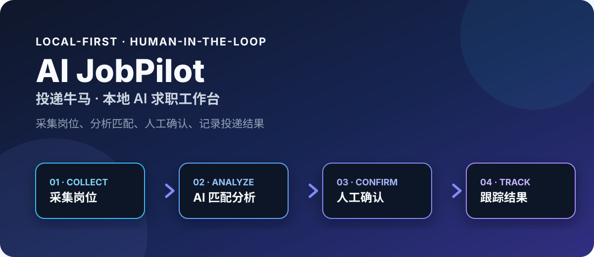
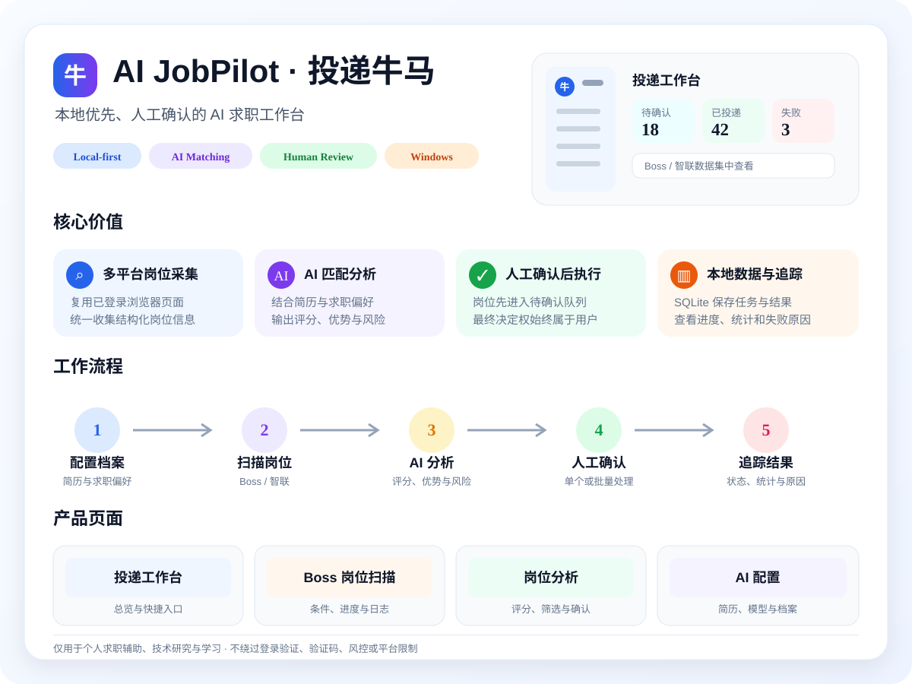
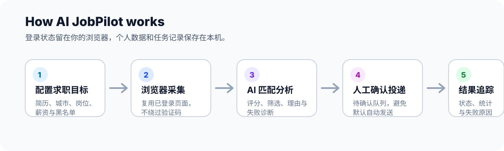
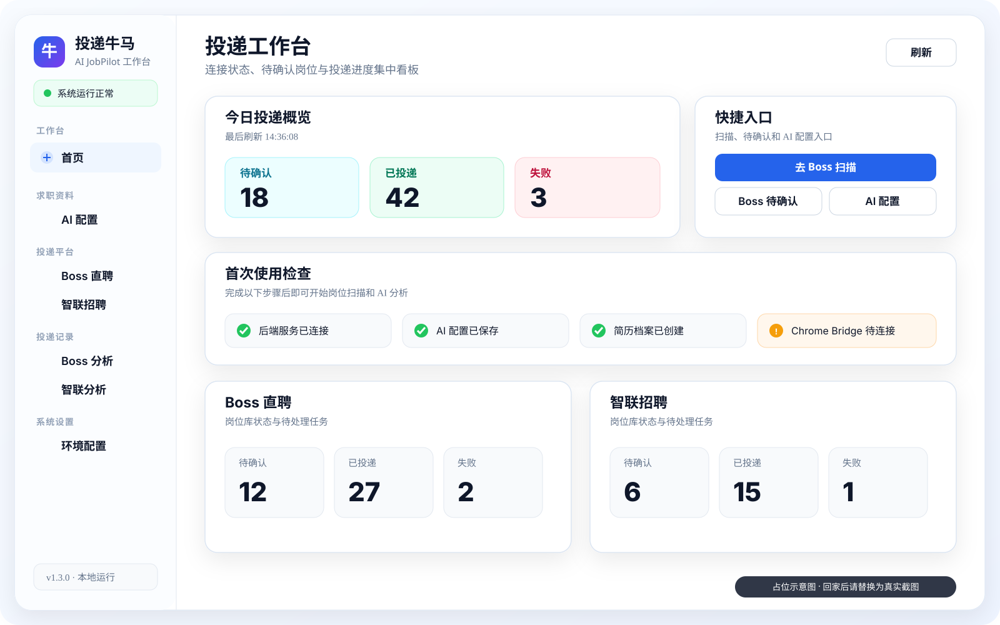
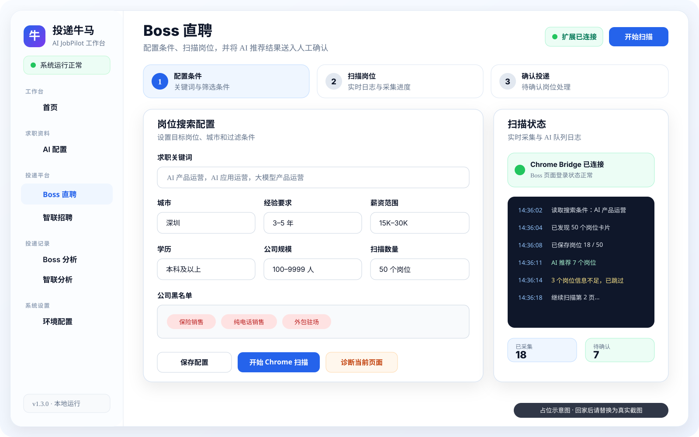
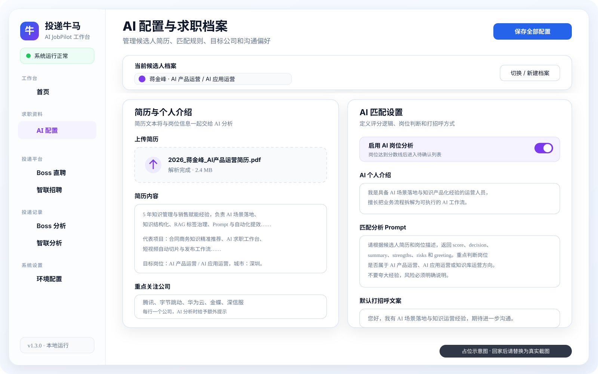

<div align="center">

# AI JobPilot · 投递牛马

**一个本地运行、由用户确认后执行的 AI 求职工作台。**  
采集岗位、分析匹配度、管理待确认任务，并持续记录投递结果。

[English](README.en.md) · [快速开始](#快速开始) · [完整流程](TASK_FLOW.md) · [架构说明](ARCHITECTURE.md) · [路线图](ROADMAP.md) · [安全说明](SECURITY.md)

[](CHANGELOG.md)
[](WINDOWS_SETUP.md)
[](build.gradle.kts)
[](front/package.json)
[](https://github.com/damingishere-coder/AI-JobPilot/actions/workflows/ci.yml)
[](LICENSE)

</div>



## 一图看懂 AI JobPilot



> AI JobPilot 不会替你绕过登录验证、验证码或平台限制。岗位进入“待确认”后，仍需由你决定是否执行投递。

## 为什么使用 AI JobPilot

求职过程中最耗时间的并不只是“找到岗位”，而是反复筛选、判断匹配度、记录投递结果，以及在多个平台之间来回切换。

AI JobPilot 将这些步骤集中到一个本地工作台中：

- **少做重复筛选**：根据简历、目标岗位、城市、薪资和黑名单分析岗位匹配度。
- **保留最终控制权**：AI 命中的岗位先进入待确认队列，不默认替你直接投递。
- **复用现有登录状态**：Chrome Bridge 在你已经登录的招聘页面中辅助采集，不要求把 Cookie 写进项目配置。
- **数据保存在本机**：简历、配置、岗位与任务记录默认保存在本地 SQLite 数据库中。
- **统一查看结果**：通过统计卡片、筛选、任务状态和失败原因持续跟踪求职进展。

## 工作流程



## 产品预览

> 以下为依据当前前端代码绘制的临时占位图。回家后截取真实页面时，直接用同名文件覆盖即可，README 无需再次修改。

### 投递工作台



### Boss 岗位扫描



### AI 岗位分析与人工确认


### AI 配置与求职档案



## 核心能力

### 多候选人求职配置

管理候选人档案、简历文本、目标岗位、城市、薪资、AI 模型配置、平台配置和黑名单。

### 浏览器辅助岗位采集

Boss 直聘和智联招聘支持 Chrome Bridge，复用你已登录的 Chrome 页面采集结构化岗位信息，并支持中断恢复和异常页诊断。

### AI 匹配分析

将岗位信息与简历和求职偏好进行匹配，提供评分、筛选和分析结果。命中分数线的岗位进入待确认队列。

### 人工确认后执行

系统不会默认绕过人工判断。用户可在分析页查看岗位详情，确认单个或批量任务后再进入投递流程。

### 本地任务与结果追踪

使用 SQLite 保存岗位、任务状态、统计结果和失败原因，便于后续复盘和继续处理。

### Windows 一键启动

提供 Windows 批处理和 PowerShell 启动脚本，同时保留 Docker 与手动开发启动方式。

## 平台支持

| 平台 | 岗位采集 | AI 分析 | 人工确认 | 当前定位 |
| --- | :---: | :---: | :---: | --- |
| Boss 直聘 | ✅ | ✅ | ✅ | Chrome Bridge 主要流程；含受限 API POC 与页面降级采集 |
| 智联招聘 | ✅ | ✅ | ✅ | Chrome Bridge 主要流程 |
| 猎聘 | 🟡 | ✅ | ✅ | 本地基础流程，仍在持续适配 |
| 前程无忧 51job | 🟡 | ✅ | ✅ | 本地基础流程，仍在持续适配 |

`✅` 表示当前主流程支持，`🟡` 表示已有基础能力但稳定性和覆盖范围仍需继续验证。

## 快速开始

### Windows 本机启动

环境要求：

- Windows 10 / 11
- Java 21
- Node.js 20.19 或更高版本
- pnpm
- Chrome
- Git

克隆项目后，在仓库根目录双击：

```text
start_windows.bat
```

也可以在 PowerShell 中运行：

```powershell
.\start_windows.ps1
```

启动成功后打开：

```text
前端：http://localhost:6866
后端健康检查：http://localhost:8888/api/health
```

当首页检查项正常、健康检查返回 `UP` 时，说明基础服务已经启动成功。

完整的新手安装与排错步骤见 [WINDOWS_SETUP.md](WINDOWS_SETUP.md)。

### Docker 启动

安装 Docker Desktop 后，在根目录运行：

```powershell
.\start_docker.ps1
```

或者双击：

```text
start_docker.bat
```

Docker 方式会读取 `.env`。请从 `.env.example` 复制本地配置，不要提交真实密钥或账号信息。

## Chrome Bridge

Boss 直聘和智联招聘推荐使用 Chrome Bridge：

1. 打开 `chrome://extensions/`。
2. 开启“开发者模式”。
3. 点击“加载已解压的扩展程序”。
4. 选择仓库中的 `chrome-extension` 目录。
5. 打开 `http://localhost:6866`，确认扩展连接正常。
6. 在 Chrome 中登录招聘平台，再从工作台开始扫描。

扩展只负责辅助本地流程，不会绕过登录验证、验证码或平台投递限制。

## 手动开发启动

后端：

```powershell
.\gradlew.bat bootRun
```

前端：

```powershell
cd front
pnpm install
pnpm dev
```

常用检查：

```powershell
# 后端测试
.\gradlew.bat test

# 后端构建
.\gradlew.bat build

# 前端检查
cd front
pnpm lint
```

## 数据与安全边界

AI JobPilot 设计为个人电脑上的本地工具，不建议直接部署到公网供多人共用。

请勿提交以下内容：

- `.env`、API Key、账号密码、Cookie、Token
- 本地 SQLite 数据库及备份
- 简历、聊天截图和其他个人敏感资料
- Chrome 用户数据、浏览器缓存和 Playwright 缓存

默认数据库位于：

```text
db/getjobs.db
```

更多说明见 [SECURITY.md](SECURITY.md)。

## 当前限制

- 招聘网站页面结构变化后，选择器和采集逻辑可能需要更新。
- 项目不能保证所有平台、账号和岗位场景下都能稳定运行。
- 项目不会绕过平台风控、登录验证、验证码或投递频率限制。
- OpenClaw 通路仍属于实验能力，不是 Windows 主流程的必需项。
- 当前以 Windows 单机使用为主，不是面向公网多人使用的 SaaS 服务。

## 文档

| 文档 | 用途 |
| --- | --- |
| [WINDOWS_SETUP.md](WINDOWS_SETUP.md) | Windows 安装、启动、验证和排错 |
| [TASK_FLOW.md](TASK_FLOW.md) | 从简历配置到确认投递的完整流程 |
| [ARCHITECTURE.md](ARCHITECTURE.md) | 系统架构、模块职责与数据流 |
| [SECURITY.md](SECURITY.md) | 本地数据、Cookie、API Key 与安全边界 |
| [ROADMAP.md](ROADMAP.md) | 当前阶段、后续方向与优先事项 |
| [CHANGELOG.md](CHANGELOG.md) | 版本更新记录 |
| [CONTRIBUTING.md](CONTRIBUTING.md) | Bug、功能建议和代码贡献方式 |
| [doc/BOSS_API_POC.md](doc/BOSS_API_POC.md) | Boss 搜索 API POC 与 Windows 验证 |
| [doc/文档索引.md](doc/文档索引.md) | 历史资料和补充文档索引 |

## 项目状态

当前版本为 `1.3.0`，重点是巩固 Boss / 智联 Chrome Bridge 采集、AI 分析、人工确认、失败诊断和本地可维护性。

后续计划包括统一平台适配层、继续组件化其他分析页面，以及在明确合规和人工确认边界后评估 AI 代聊、提醒和面试信息汇总能力。详见 [ROADMAP.md](ROADMAP.md)。

## 参与贡献

欢迎通过 Issue 提交：

- 招聘平台页面改版导致的采集问题
- Windows 安装或启动问题
- 平台适配建议
- 文档改进
- 可复现的 Bug

提交代码前请阅读 [CONTRIBUTING.md](CONTRIBUTING.md)。涉及账号、Cookie、简历或密钥的问题，请先阅读 [SECURITY.md](SECURITY.md)，不要在公开 Issue 中粘贴敏感信息。

## License

本项目使用自定义 **TOUDI NIUMA Non-Commercial License 1.0**。

允许在保留署名和许可证声明的前提下，为非商业目的使用、复制、修改和分发；商业使用、付费托管、商业产品集成或付费咨询等用途需要获得版权所有者授权。完整条款见 [LICENSE](LICENSE)。

## 免责声明

本项目仅用于个人求职辅助、技术研究和学习。使用者需要自行遵守招聘平台规则以及适用的法律法规，并对自己的账号操作、数据处理和投递行为负责。
