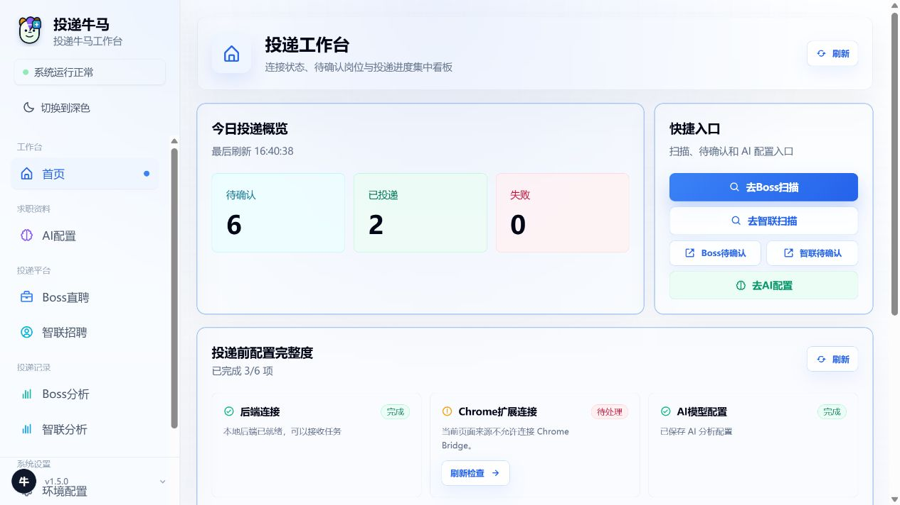
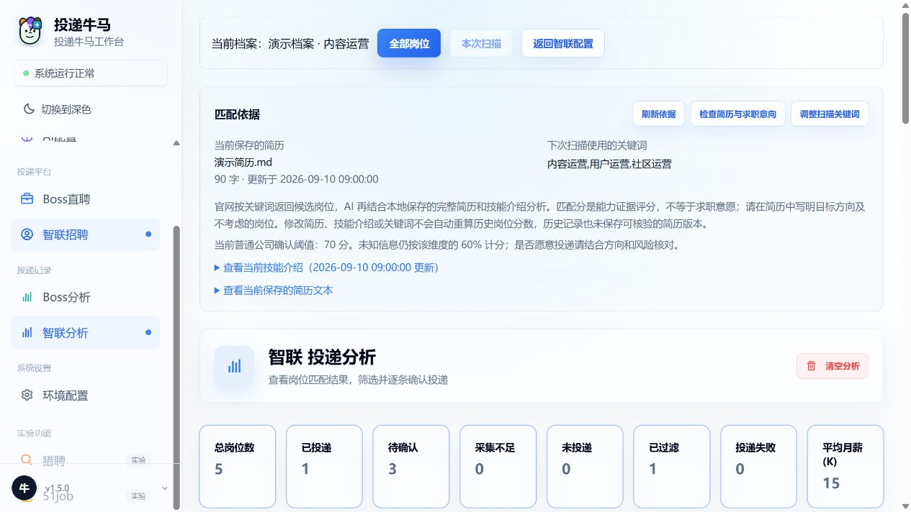
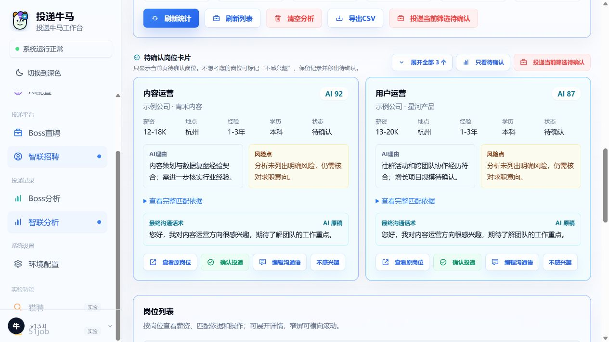
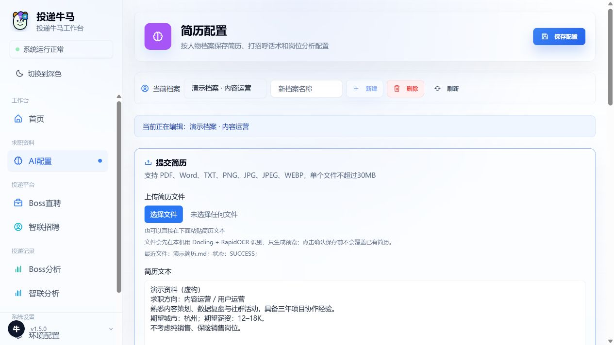

<div align="center">


# AI JobPilot · 投递牛马

**把时间留给值得投的岗位。**

在自己的电脑上整理简历、采集岗位、查看 AI 匹配依据，确认后再投递。

[English](README.en.md) · [下载 1.5](https://github.com/damingishere-coder/AI-JobPilot/releases/tag/v1.5.0) · [快速开始](#快速开始) · [使用文档](docs/README.md) · [反馈问题](https://github.com/damingishere-coder/AI-JobPilot/issues)

[](https://github.com/damingishere-coder/AI-JobPilot/releases/latest) [](https://github.com/damingishere-coder/AI-JobPilot/actions/workflows/ci.yml) [](https://github.com/damingishere-coder/AI-JobPilot/actions/workflows/codeql.yml) [](LICENSE)



*v1.5 实际界面 · 虚构演示数据 · 截图预览未连接招聘平台*

</div>

## 从岗位发现，到你来决定

AI JobPilot 是面向个人求职者的本地工作台。把分散在浏览器、简历文件和投递记录里的信息集中起来，让每一次投递都有据可查。

| 你要做的事 | 工作台怎样帮你 |
| --- | --- |
| 找到目标岗位 | 通过 Chrome Bridge 采集 BOSS 直聘、智联招聘岗位，保留扫描进度与异常信息 |
| 判断是否适合 | 结合简历、求职方向和岗位描述，展示匹配评分、依据与风险；评分不等于你的求职意愿 |
| 准备开场沟通 | 查看、编辑岗位沟通草稿，在确认界面核对最终话术 |
| 保持投递有序 | 按档案管理记录，区分待确认、已投递、失败和结果待确认；跳过不感兴趣的岗位 |

**保存资料 → 设置搜索条件 → 采集与分析 → 核对岗位和话术 → 确认投递 → 查看结果**

## 看看新版界面

### 匹配依据看得见

智联分析页展示当前保存的简历、扫描关键词和确认阈值。修改资料不会自动重算历史评分，页面会明确提示这一区别。



### 投递前，先看理由和话术

待确认卡片集中展示岗位要求、匹配理由、风险和最终沟通语。你可以编辑草稿、查看原岗位，或标记「不感兴趣」。



<details>
<summary><strong>查看更多：按档案管理求职资料</strong></summary>

简历、求职意向和分析配置集中维护。文件识别先生成预览，确认保存后才更新简历。



</details>

图片来自 v1.5 前端构建，保留浏览器原始截图。所有公司、岗位、简历与统计均为演示数据，不代表真实投递结果。详见 [截图说明](docs/images/screenshots/README.md)。

## 快速开始

**推荐环境：Windows 10 / 11、Java 21、Node.js 24 LTS、pnpm 10.20.0、Chrome、Git。**

### 1. 获取并启动

在 PowerShell 中执行：

```powershell
git clone --branch v1.5.0 --depth 1 https://github.com/damingishere-coder/AI-JobPilot.git
cd AI-JobPilot
cd front
pnpm install --frozen-lockfile
cd ..
.\start_windows.bat
```

首次启动会下载依赖。启动后，在 **Chrome** 打开 **http://127.0.0.1:6866**。

还没安装运行环境？按 [Windows 新手指南](WINDOWS_SETUP.md) 逐步操作。已有服务正在运行时，先使用现有入口，避免重复启动。

### 2. 连接 Chrome Bridge

打开 `chrome://extensions/`，开启「开发者模式」，点击「加载已解压的扩展程序」，选择项目的 `chrome-extension` 文件夹。v1.5 配套的扩展版本为 **1.8.0**；更新文件后还需在扩展页点击「重新加载」，并刷新工作台和平台页面。

### 3. 开始第一次分析

在「环境配置」设置模型连接，在「AI配置」新建档案并保存简历和求职方向；然后登录目标招聘平台，设置关键词和筛选条件。先完成一轮采集，查看分析页的待确认岗位，再决定是否投递。完整步骤见 [首次使用与任务流程](TASK_FLOW.md)。

> 本地保存不等于完全离线：AI 分析会把相关简历和岗位内容发送给你配置的模型服务。招聘平台连接、模型服务与本地工作台需要分别配置。

## 下载哪个文件？

[v1.5.0 正式版下载](https://github.com/damingishere-coder/AI-JobPilot/releases/tag/v1.5.0) 提供以下产物：

| 文件 | 用途 |
| --- | --- |
| `AI-JobPilot-v1.5.0-source.zip` | 源码及启动脚本；按 Windows 指南准备运行环境 |
| `AI-JobPilot-v1.5.0.jar` | 包含前端的 Java 应用；需要 Java 21 与本地配置，适合进阶部署 |
| `AI-JobPilot-v1.5.0-chrome-extension.zip` | 解压后加载到 Chrome；内部扩展版本为 1.8.0 |
| `AI-JobPilot-v1.5.0-frontend-static.zip` | 前端静态资源，供已有后端集成使用 |
| `SHA256SUMS.txt` | 下载文件的完整性校验值 |

目前没有免环境安装的 Windows `.exe` 安装器。JAR、静态包与扩展分别承担不同职责，详见 [下载、校验与运行](docs/releases.md) 和 [1.5 发布说明](docs/releases/v1.5.0.md)。

## 平台支持与当前边界

| 平台 | 当前定位 | 使用方式 |
| --- | --- | --- |
| BOSS 直聘 | 主要维护 | Chrome Bridge 采集、AI 分析、人工确认后投递 |
| 智联招聘 | 主要维护 | Chrome Bridge 采集、分析依据、待确认队列与结果核对 |
| 猎聘 / 51job | 实验兼容 | 保留旧适配器；侧栏入口禁用，普通启动默认只读采集，不能视为已完整验收 |

- 招聘网站改版、登录失效或验证提示可能中断流程，需要在 Chrome 中处理后再继续。
- 结果不明确时需核对记录，避免重复投递；AI 分数和话术都需要人工审阅。
- 当前以 Windows 本地单人使用为主，不适合直接暴露到公网。Docker 是进阶开发路径，见 [Docker 指南](README_DOCKER.md)。
- [Demo 示例文件](demo/README.md) 尚未接入应用，不提供一键 Demo；OpenClaw 等实验通路不是主流程必需项。

## 文档与贡献

| 想了解什么 | 从这里开始 |
| --- | --- |
| 安装、首次使用、常见问题 | [Windows 指南](WINDOWS_SETUP.md) · [任务流程](TASK_FLOW.md) |
| 所有文档和版本记录 | [文档中心](docs/README.md) · [更新日志](CHANGELOG.md) · [路线图](ROADMAP.md) |
| 本地开发与测试 | [开发指南](docs/development/setup.md) · [架构](ARCHITECTURE.md) |
| 报告问题、贡献代码 | [参与贡献](CONTRIBUTING.md) · [Issues](https://github.com/damingishere-coder/AI-JobPilot/issues) |
| 数据存储与安全报告 | [安全说明](SECURITY.md) |

欢迎提交可复现的问题、脱敏测试样本和文档改进。请勿在 Issue、截图或提交中公开真实简历、聊天、Cookie、API Key 或数据库。

## 许可

采用 [TOUDI NIUMA Non-Commercial License 1.0](LICENSE)：保留署名和许可证声明后可用于非商业目的；商业使用、付费托管或商业集成需要另行授权。

本项目用于个人求职辅助、技术研究与学习。请遵守招聘平台规则，并对自己的账号操作、数据处理和投递行为负责。
